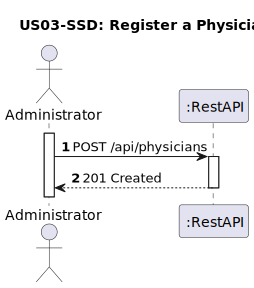
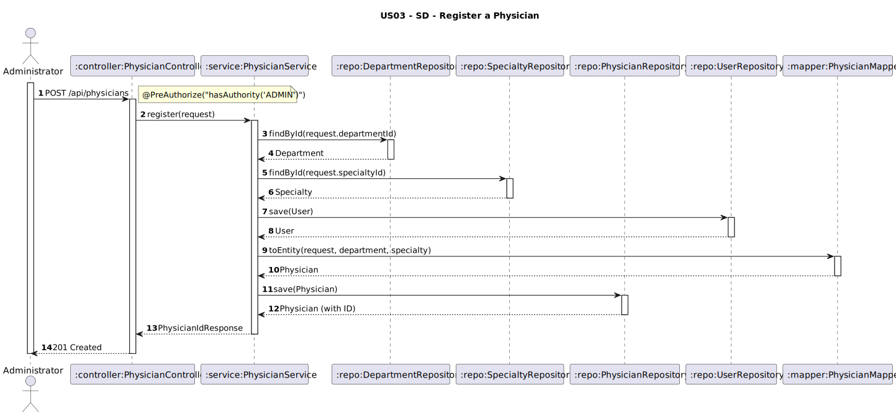

# US03 - Register a Physician

## 1. Requirements Engineering

### 1.1. User Story Description
As an Administrator, I want to register a physician with details such as name, specialty, contact information, and working hours.

### 1.2. Customer Specifications and Clarifications
**From the client clarifications:**
> **Q1:** Um médico pode pertencer a vários departamentos? E pode ter mais do que uma especialização?  
> **A1:** Um médico pertence a **um único departamento** e possui **apenas uma especialidade**.

> **Q2:** Que atributos tem cada departamento?  
> **A2:** `code` (máx. 5 caracteres), `name`, `description` (opcional).

> **Q3:** Que tipo de informação está incluída em "contact information"?  
> **A3:** O médico pode ter **vários e-mails, telefones e moradas**.

> **Q4:** Como devem ser definidos os working hours?  
> **A4:** Deve ser fornecida **uma hora de início e de fim**, comum a todos os dias da semana.

### 1.3. Acceptance Criteria
* The system must allow the administrator to register:
    * Full name
    * Username
    * Password
    * License number
    * Specialty (single)
    * Department (single)
    * Contact information (including multiple emails and phone numbers)
    * Working hours (start and end time, same for all weekdays)
    * Optional profile photo
* Analysis and design documentation:
    * Domain model
    * Design justification
    * Sequence diagrams (SSD and SD)
    * Unit test
* OpenAPI specification
* POSTMAN collection with sample request and test
* Proper handling of concurrent access

### 1.4. Found out Dependencies
* D001-01: Requires that available specialties and departments have been previously registered (Setup phase).

### 1.5 Input and Output Data
**Input Data:**
- `fullName: String`
- `licenseNumber: String`
- `username: String` (valid email)
- `password: String` (validated according to password policy)
- `specialtyId: String`
- `departmentId: String`
- `contactInfo: { emails: [String], phones: [String]}`
- `workingHours: { start: Time, end: Time }`
- `photo (optional): { url: String, uploadedAt: DateTime }`

**Output Data:**
- Confirmation of physician creation
- The generated physician ID

### 1.6. System Sequence Diagram (SSD)


### 1.7 Other Relevant Remarks
* This endpoint is secured and requires ADMIN role authentication.
* The administrator must assign a `username` (valid email) and a `password` to the physician at registration.
* The system must validate that:
  * `username` is unique and a valid email address
  * `password` has at least 10 characters, including at least one uppercase letter, one digit, and one special character
  * `licenseNumber` is unique
  * `code` of department has ≤ 5 characters
  * `specialtyId` and `departmentId` refer to existing entities
* The physician’s password must be encrypted before being stored.

### 1.8 Example Request and Response (JSON)

**Request (POST /api/physicians):**
```json
{
  "fullName": "Dr. Claudia Santos",
  "licenseNumber": "MD16345",
  "username": "dra.claudia@hotmail.com",
  "password": "FCP1976!FCP",
  "specialtyId": "SPC01",
  "departmentId": "DEP02",
  "emails": ["dr.claudia@hotmail.com", "clausia.santos@clinic.com"],
  "phoneNumbers": ["+351912785678", "+351912399679"],
  "workingHourStart": "09:00",
  "workingHourEnd": "17:00"
}
```
**Response (201 Created):**
```json
{
  "physicianId": "PHY01",
  "message": "Physician registered successfully."
}
```

---

## 2. Design - User Story Realization

### 2.1. Rationale

The operation is executed by an administrator, with full access to the physician’s structure. The design respects the domain model, where:
- `Physician` is associated with `ContactInfo`, `WorkingHours`, `Department`, `Specialty`, and optionally a `Photo`.
- Relationships are 1:1 (except for optional photo).

### Systematization

Upon receiving the input DTO, the service layer:
1. Validates all fields (including uniqueness of license number).
2. Loads referenced `Specialty` and `Department` entities.
3. Creates the `Physician` entity and persists it.
4. Returns confirmation with generated ID.

### Design Justification
* Follows SRP: contact, schedule, and identity are handled by specialized classes.
* Follows OCP: additional contact types or specializations can be added sem impacto nas entidades principais.
* Prepara a aplicação para possível separação por módulos.

## 2.2. Sequence Diagram (SD)

