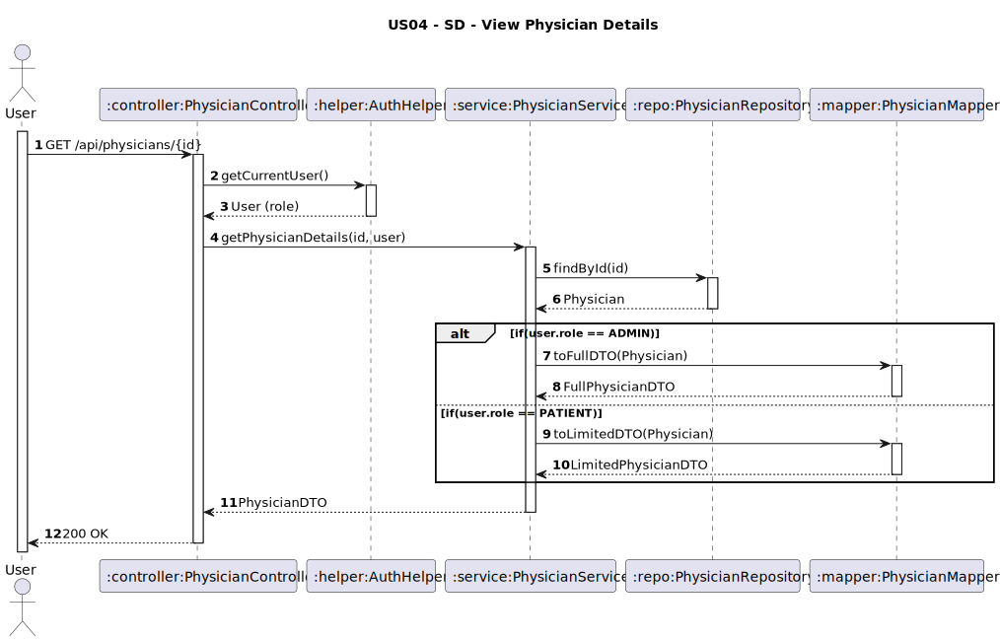

# US04 - View Physician Details

## 1. Requirements Engineering

### 1.1. User Story Description
As an Administrator or Patient, I want to view a physician’s details given the physician ID.

### 1.2. Customer Specifications and Clarifications
**From the client clarifications:**

> **Q1:** O administrador e o paciente devem ter o mesmo nível de acesso aos detalhes de um médico? Isto é, nesta operação devem ser mostrados os mesmos detalhes tanto ao administrador como ao paciente?  
> **A1:** Não. O paciente não pode ter acesso aos dados de contacto do médico. Apenas ao nome e especialidade.

### 1.3. Acceptance Criteria
* The system must return:
  * For **Administrator**: full physician details (full name, specialty, contact information, department, working hours).
  * For **Patient**: only full name and specialty.
* Analysis and design documentation:
  * Domain model
  * Design justification
  * Sequence diagrams (SSD and SD)
  * Unit test
* OpenAPI specification
* POSTMAN collection with sample request and test
* Proper handling of concurrent access 

### 1.4. Found out Dependencies
* D004-01: Requires that physicians are previously registered in the system (US03).

### 1.5 Input and Output Data
**Input Data:**
* Path Variable: `physicianId`
* User role: Administrator or Patient

**Output Data:**
* Typed Data:
  * For **ADMIN**:
- `fullName: String`
- `specialtyId: String`
- `contactInfo: { emails: [String], phones: [String], addresses: [Address] }`
- `departmentId: String`
- `workingHours: { start: Time, end: Time }`
  * For **PATIENT**:
- `fullName: String`
- `specialtyId: String`
- `specialtyName: String`
* HTTP Status:
  * 200 OK – Success

### 1.6. System Sequence Diagram (SSD)


### 1.7 Other Relevant Remarks
* This endpoint is secured and requires ADMIN and PATIENT role authentication.
* The differentiation of data exposure is handled by the service layer using role-based logic.

### 1.8 Example Request and Response (JSON)

**Request (GET http://localhost:8080/api/physicians/PHY01):**

**Response for ADMIN (200 OK):**
```json
{
  "fullName": "Dr. Claudia Santos",
  "specialtyId": "SPC01",
  "departmentId": "DEP02",
  "contactInfo": {
    "emails": [
      "dr.claudia@hotmail.com",
      "clausia.santos@clinic.com"
    ],
    "phoneNumbers": [
      "+351912785678",
      "+351912399679"
    ]
  },
  "workingHours": {
    "start": "09:00:00",
    "end": "17:00:00"
  }
}
```
**Response for PATIENT (200 OK):**
```json
{
  "fullName": "Dr. Claudia Santos",
  "specialtyId": "SPC01",
  "specialtyName": "Cardiology"
}
```
---

## 2. Design - User Story Realization

### 2.1. Rationale

The system retrieves physician details based on the authenticated user's role:
- **Administrators** receive full details.
- **Patients** receive limited details.

### Systematization
Upon receiving the request to view a physician's details, the system:

1. Uses the **AuthHelper** to retrieve the authenticated user and identify their role.
2. Fetches the `Physician` entity from the database using the provided `physicianId`.
3. Based on the user's role:
  - If **Administrator**, maps the entity to a full `PhysicianDTO`.
  - If **Patient**, maps the entity to a limited `PhysicianDTO` (only name and specialty).
4. Returns the appropriate DTO in the response with HTTP **200 OK**.

### Design Justification
- Follows **SRP** (Single Responsibility Principle): Each layer handles a specific concern (Controller, Service, Mapper, Helper).
- The use of **Mapper** abstracts entity-to-DTO conversion, facilitating future changes without impacting core logic.
- Ensures **data privacy** by dynamically adjusting the response content based on user roles.

### 2.2. Sequence Diagram (SD)


