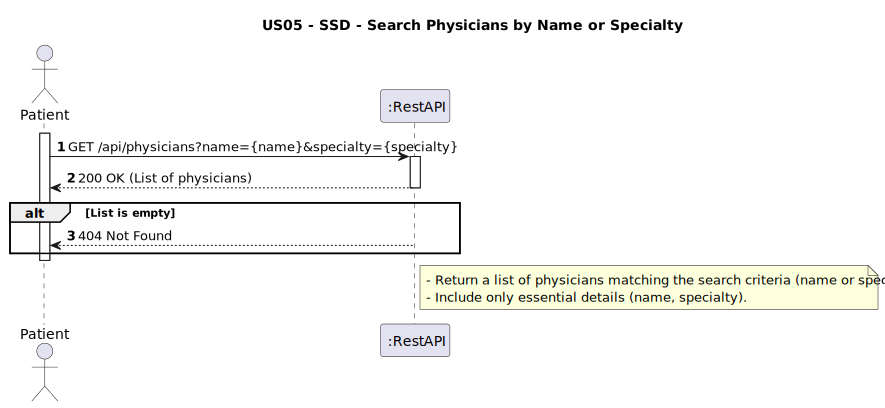
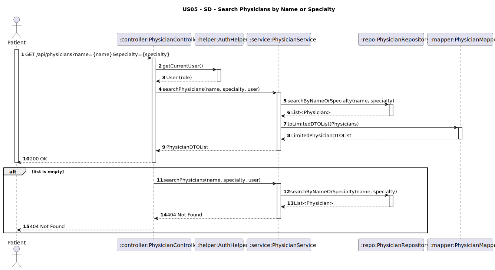

# US05 - Search Physicians by Name or Specialty

## 1. Requirements Engineering

### 1.1. User Story Description
As a Patient, I want to search physicians by name or specialty.

### 1.2. Customer Specifications and Clarifications
**From the client clarifications:**
> **Question:**  
> O paciente pode procurar apenas com o primeiro e último nome ou tem de ser o nome completo?
>
> **Answer:**  
> Pode procurar apenas com parte do nome, ex., se o utilizador pesquisar "Silva Sousa" deverão aparecer todos os médicos cujo nome contenha "Silva Sousa" independentemente de ser o primeiro ou utltimo nome

### 1.3. Acceptance Criteria
* The system must allow a Patient to search physicians by:
    * Partial or full name (case-insensitive).
    * Specialty name.
* The search result must include:
    * Physician full name.
    * Specialty name.
* This endpoint must:
    * Support authenticated access (requires JWT token).
    * Be read-only (no data modification).
* Analysis and design documentation:
    * Domain model
    * Design justification
    * Sequence diagrams (SSD and SD)
    * Unit test
* OpenAPI specification
* POSTMAN collection with sample request and test
* Proper handling of concurrent access (not applicable - read-only operation)

### 1.4. Found out Dependencies
* D005-01: Requires that physicians are previously registered in the system (US03).

### 1.5 Input and Output Data
**Input Data:**
- `name: String (optional) — partial or full name of the physician (e.g., "Silva Sousa")`
- `specialty: String (optional)`

**Output Data:**
- `fullName: String`
- `specialtyName: String`

### 1.6. System Sequence Diagram (SSD)


### 1.7 Other Relevant Remarks
* This endpoint is secured and requires JWT authentication.
* The differentiation of data exposure is handled by the service layer using role-based logic.

### 1.8 Example Request and Response (JSON)

**GET /api/physicians?name=silva&specialty=cardio**
* Host: pcmclinic.example.com
  **Response (200 OK):**
```json  
 [
  {
        "fullName": "Dr. Claudia Santos",
        "specialtyId": "SPC01",
        "specialtyName": "Cardiology"
    },

  ]
  ```
 **Response (404 Not Found)**
```json
{
    "message": "Not found",
    "details": [
        "No physicians found with the given criteria"
    ]
}
```


## 2. Design - User Story Realization

### 2.1. Rationale
This functionality allows patients to quickly find physicians using familiar search terms such as names or specialties. It improves usability by supporting partial matches and abstracts away the need for exact identifiers.
### Systematization
Upon receiving the request with the search query:
1. The PhysicianController retrieves the authenticated user using AuthHelper.
2. The PhysicianService uses the PhysicianRepository to find matching records by name or specialty.
3. Matching Physician entities are transformed into LimitedPhysicianDTOs via PhysicianMapper.
4. The controller returns the list with only name and specialty, as required.

### Design Justification
* Leverages existing domain relationships (Physician → Specialty) directly.
* Clean separation of concerns across controller, service, repository, and mapper.
* Minimal data exposure protects patient privacy and keeps responses lightweight.
* Easily expandable in future to include filters by department or working hours.

## 2.2. Sequence Diagram (SD)

