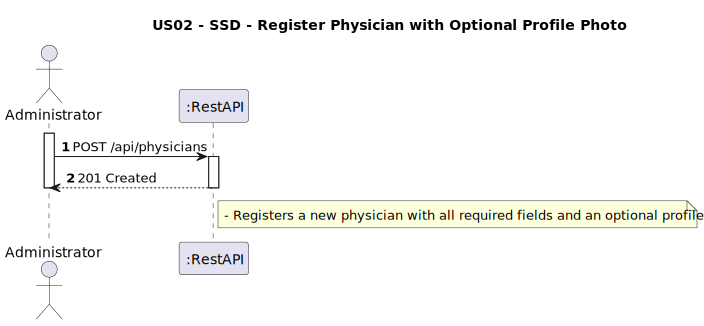

# US02 - Register Physician with Optional Profile Photo

## 1. Requirements Engineering

### 1.1. User Story Description
As an Administrator, I want to register a physician with an optional profile photo.

### 1.2. Customer Specifications and Clarifications
**From the client clarifications:**
> **Q1:** Onde deve ser guardado a imagem, dentro do projeto?
>
> **A1:** Trata-se de uma decisão técnica da equipa. Falamos disso na aula teorica da semana passada. podem optar por guardar na BD ou no file system

### 1.3. Acceptance Criteria
* The system must allow the administrator to register a physician:
    * With all the standard required data (name, license, contact, department, specialty, working hours)
    * With or without a profile photo
* The profile photo must be:
    * Stored in a photo storage service (local or cloud)
    * Linked to the physician entity as a `photo` object with `url` and `uploadedAt`
* On success, return:
    * HTTP 201 Created
    * The new physician’s ID and photo info (if any)

### 1.4. Found out Dependencies
* D001-01: Requires the department and specialty to exist (Bootstrap Initial Data).
* D001-02: Requires validation of unique license number and username.
* D001-03: Requires proper setup of photo storage mechanism.

### 1.5 Input and Output Data
**Input Data:**
- Part 1 (JSON File):
- `fullName: String`
- `licenseNumber: String`
- `username: String` (valid email)
- `password: String` (validated according to password policy)
- `specialtyId: String`
- `departmentId: String`
- `contactInfo: { emails: [String], phones: [String]}`
- `workingHours: { start: Time, end: Time }`

- Part 2 (optional file):
- `Photo File (jpg)`

**Output Data:**
  - `physicianId: String`
  - `message: String`
  - `photo: { url: String, uploadedAt: DateTime }`

### 1.6. System Sequence Diagram (SSD)


### 1.7 Other Relevant Remarks
* This endpoint is secured and requires ADMIN role authentication.
* If no photo is provided, the physician is registered without a profile image.
* If a photo is provided, it is stored and its reference is saved in the physician entity as a `photo` object.
* Input must be validated:
    * Unique username and license number
    * Valid departmentId and specialtyId
* The DTO must support file handling via `MultipartFile`.

### 1.8 Example Request and Response (JSON)

**Request:**
- Part 1 (JSON FILE):
```json
 {
  "fullName": "Dr. João Ribeiro",
  "licenseNumber": "MD16555",
  "username": "joao.ribeiro@clinic.com",
  "password": "Porto123456!",
  "specialtyId": "SPC03",
  "departmentId": "DEP01",
  "emails": ["joao.ribeiro@clinic.com"],
  "phoneNumbers": ["+351912111222"],
  "workingHourStart": "08:00",
  "workingHourEnd": "17:00"
}
```
- Part 2 (optional file):
  `photo = campeao.jpg` *(image/jpg)*

**Response (201 Created):**
```json
{
  "physicianId": "PHY09",
  "message": "Physician registered successfully.",
  "photo": {
    "url": "/photos/PHY09_1749063317237_campeao.jpg",
    "uploadedAt": "2025-06-04T19:55:17.2627387"
  }
}
```
---

## 2. Design - User Story Realization

### 2.1. Rationale

The operation extends the existing registration process by supporting an optional photo upload. The system must be able to handle multipart input, validate and persist the photo, and associate it to the physician.

### Systematization

Upon receiving the multipart request:
1. Extract JSON data and optional photo.
2. Validate input fields (username, license, specialty, department).
3. If photo is present:
    * Store the image
    * Get a URL/path and set it with timestamp in the `photo` object
4. Persist the physician
5. Return success response with new physician ID and photo details (if applicable)

### Design Justification
* Respects SRP by delegating photo storage to a dedicated service.
* Maintains compatibility with existing registration logic.
* Supports flexibility and scalability for file handling.

## 2.2. Sequence Diagram (SD)


