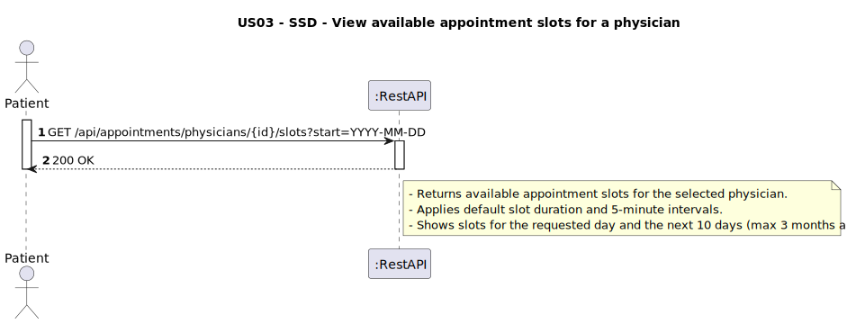
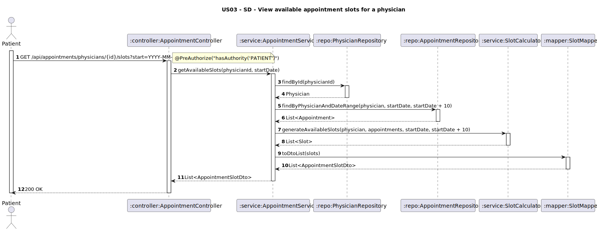

# US03 - View available appointment slots for a physician

## 1. Requirements Engineering

### 1.1. User Story Description
As a Patient, I want to view available appointment slots for a physician.

### 1.2. Customer Specifications and Clarifications
**From the client clarifications:**
> **Q1:** Ao consultar os horários disponíveis para uma marcação de uma consulta, devemos considerar uma duração padrão para cada slot? Ou dependendo do tipo de consulta a duração de um slot muda?
>
> **A1:** Duração padrão é igual para todos os tipos de consulta.


> **Q2:** Deve ser considerado algum tipo de intervalo entre slots?
>
> **A2:** 5 minutos.

> **Q3:** Na visualização de slots é sempre para um único dia específico que o paciente fornece ou o sistema deveria, por exemplo, mostrar os próximos N dias disponíveis ou permitir uma pesquisa por um intervalo de datas?
>
> **A3:** Deve mostrar o dia inserido pelo utilizador e os 10 dias seguintes.


> **Q4:** Existe alguma regra sobre com quanta antecedência ou quão próximo da data atual os slots devem ser mostrados?
>
> **A4:** No máximo 3 meses no futuro.

> **Q5:** O horário de trabalho do médico já considera pausas, ou o sistema de slots precisa de ser inteligente para bloquear horários de almoço, por exemplo?
>
> **A5:** Ignorem de momento.

> **Q6:** Caso o paciente pesquise por slots para o dia de hoje, devemos mostrar apenas os slots futuros no dia, ou todos os slots calculados desde o início do horário de trabalho do médico?
>
> **A6:** Futuros.

### 1.3. Acceptance Criteria
* The system must allow authenticated patients to:
    * View available appointment slots for a given physician
    * Filter slots using a date range (`start`)
  * The system must:
      * Return only future and unbooked slots
      * Return slots of fixed duration (e.g., 20 minutes) with 5-minute intervals
      * Return slots for the requested day and the following 10 days (max 3 months ahead)
      * For today's date, only return slots that are still in the future
      * Respond with 200 OK and a list of time intervals
      * Respond with 404 if physician does not exist
      * Validate the date format and enforce range limits

### 1.4. Found out Dependencies
* D001-01: Requires that the physician exists in the database. (Data Bootstrapping)
  * D001-02: Requires that booked appointments are already persisted. 
  * D001-03: Depends on working hours of the physician to compute valid slots.

### 1.5 Input and Output Data
**Input Data (GET /api/appointments/physicians/{id}/slots?start=YYYY-MM-DD):**
- `physicianId: String` (path variable)
- `start: Date` (query parameter, format YYYY-MM-DD)

**Output Data:**
- `date: String` (format YYYY-MM-DD)
- `startTime: String` (format HH:mm)
- `endTime: String` (format HH:mm) 


### 1.6. System Sequence Diagram (SSD)


### 1.7 Other Relevant Remarks
* Only available (unbooked) slots are returned.
  * The slots are computed based on:
      * The physician's configured working hours
      * Existing booked appointments
      * A fixed slot duration
      * A 5-minute interval between slots
  * For today's date, only future slots (relative to current time) are shown.
  * No slots are returned beyond 3 months from the current date.
  * This endpoint is secured: requires authentication with the `PATIENT` role.
  * Input dates must be in `YYYY-MM-DD` format.
  * When a `start` date is provided, the system automatically returns slots for that date and the following 10 days.


### 1.8 Example Request and Response

**Request:**
```
GET /api/appointments/physicians/PHY01/slots?start=2025-06-01
Authorization: Bearer <token> (PATIENT)
```

**Response (200 OK):**
```json
[
  {
    "date": "2025-06-01",
    "startTime": "09:00",
    "endTime": "09:20"
  },
  {
    "date": "2025-06-02",
    "startTime": "09:00",
    "endTime": "09:20"
  },
  {
    "date": "2025-06-03",
    "startTime": "09:25",
    "endTime": "09:45"
  },
  {
    "date": "2025-06-04",
    "startTime": "10:00",
    "endTime": "10:20"
  },
  {
    "date": "2025-06-05",
    "startTime": "10:25",
    "endTime": "10:45"
  },
  {
    "date": "2025-06-06",
    "startTime": "09:00",
    "endTime": "09:20"
  },
  {
    "date": "2025-06-07",
    "startTime": "09:25",
    "endTime": "09:45"
  },
  {
    "date": "2025-06-08",
    "startTime": "09:50",
    "endTime": "10:10"
  },
  {
    "date": "2025-06-09",
    "startTime": "10:15",
    "endTime": "10:35"
  },
  {
    "date": "2025-06-10",
    "startTime": "09:00",
    "endTime": "09:20"
  },
  {
    "date": "2025-06-11",
    "startTime": "09:25",
    "endTime": "09:45"
  }
]

```
---

## 2. Design - User Story Realization

### 2.1. Rationale

This feature enables patients to view available time slots before booking. It requires validating the physician and computing slots dynamically using working hours and existing appointments.

### Systematization

Upon receiving the GET request:
  1. Validate patient authentication.
  2. Fetch physician by ID.
  3. Retrieve existing appointments in the given range.
  4. Calculate free slots based on working hours and gaps.
  5. Return available slots in DTO format.

### Design Justification
* Promotes separation of concerns: repository handles data, service handles logic.
  * Allows scalability to include slot duration configuration or business rules.
  * Encapsulates slot formatting and logic inside mapper/service layer.

## 2.2. Sequence Diagram (SD)

