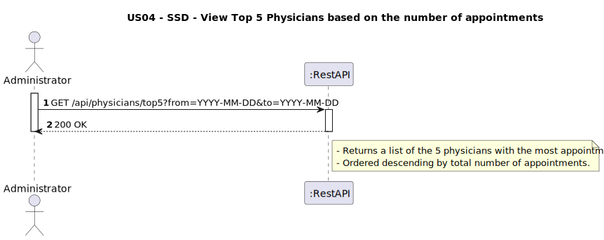
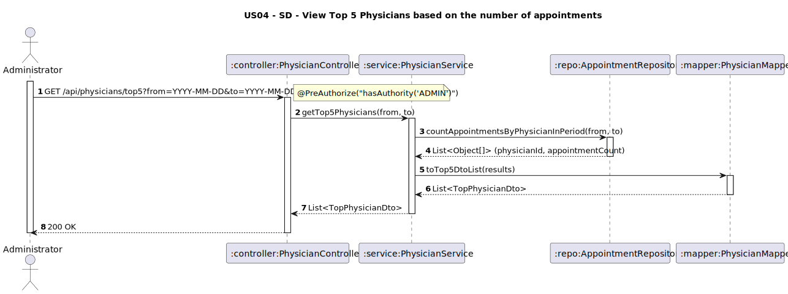

# US04 - View Top 5 physicians based on the number of appointments

## 1. Requirements Engineering

### 1.1. User Story Description
As a Administrator, I want to see the Top 5 physicians based on the number of appointments.
### 1.2. Customer Specifications and Clarifications
**From the client clarifications:**
> **Q1:** Que tipo de dados estatísticos e informações pretende ver?
>
> **A1:** O código do médico e o nome dos 5 médicos que têm mais consultas num determinado período.

> **Q2:** O top 5 physicians num certo período de tempo pode ser, por exemplo, de um mês ou de uma semana?
> 
> **A2:** Deve poder indicar o periodo livremente.

> **Q3:** Deve se contabilizar apenas os appointments concluidos ou todos?
>
> **A3:** Todos.

### 1.3. Acceptance Criteria
* The system must allow an administrator to:
  * Retrieve the 5 physicians with the highest number of appointments
  * Define the time range freely using `from` and `to` query parameters
  * Receive the results sorted in descending order
* Output must include:
  * Physician ID
  * Physician full name
  * Specialty name
  * Total number of appointments
* The count must include all appointments, regardless of status (concluded, scheduled, cancelled)
* Endpoint must be secured (`ADMIN` role)
* Return:
  * 200 OK with list of top 5 physicians
  * 404 if no physicians exist


### 1.4. Found out Dependencies
* D001-01: Requires appointments to be previously recorded. (Data Bootstrapping)
* D001-02: Depends on physician and specialty data being available.

### 1.5 Input and Output Data
**Input Data (GET /api/physicians/top5?from=YYYY-MM-DD&to=YYYY-MM-DD):**
- `from: Date` (start of the period)
- `to: Date` (end of the period)

**Output Data:**
- `physicianId: String`
- `fullName: String`
- `specialtyName: String`
- `appointmentCount: Integer`

### 1.6. System Sequence Diagram (SSD)


### 1.7 Other Relevant Remarks
* Endpoint is protected with `@PreAuthorize("hasAuthority('ADMIN')")`
* Appointment count includes both past and future appointments
* List is limited to top 5 physicians only
* Result is sorted descending by appointment count
* The administrator can define any time period using `from` and `to`.
* All appointments are included in the count, regardless of their status.

### 1.8 Example Request and Response

**Request:**
```
GET /api/physicians/top5?from=2024-06-06&to=2025-06-10
Authorization: Bearer <token> (ADMIN)
```

**Response (200 OK):**
```json
[
  
    {
      "physicianId": "PHY01",
      "fullName": "Dr. João Silva",
      "specialtyName": "Cardiologia",
      "appointmentCount": 6
    },
    {
      "physicianId": "PHY02",
      "fullName": "Dra. Maria Santos",
      "specialtyName": "Neurologia",
      "appointmentCount": 6
    },
    {
      "physicianId": "PHY03",
      "fullName": "Dr. Pedro Oliveira",
      "specialtyName": "Ortopedia",
      "appointmentCount": 6
    },
    {
      "physicianId": "PHY04",
      "fullName": "Dra. Ana Costa",
      "specialtyName": "Pediatria",
      "appointmentCount": 3
    },
    {
      "physicianId": "PHY05",
      "fullName": "Dr. Carlos Mendes",
      "specialtyName": "Dermatologia",
      "appointmentCount": 3
    }
  
]
```
---

## 2. Design - User Story Realization

### 2.1. Rationale

This use case helps administrators identify the most active physicians by total number of appointments. The response is limited to the top 5 and sorted descending. It reuses physician and appointment data and returns a summarized DTO.

### Systematization

Upon receiving the request:
1. Validate authentication and authorization
2. Query appointment repository to count appointments per physician in the given period
3. Map results to DTO format
4. Return as JSON list

### Design Justification
* Encourages efficiency by limiting query size to 5 entries
* Reuses existing appointment-physician relationships
* DTO layer ensures clear separation between data and presentation

## 2.2. Sequence Diagram (SD)

