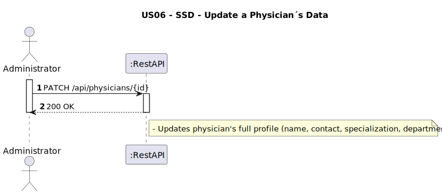
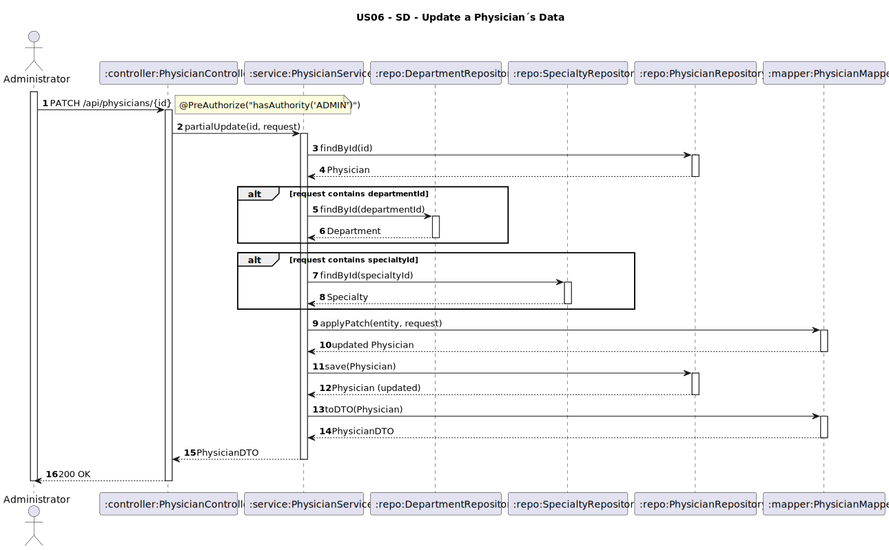

# US06 - Update a Physician´s Data

## 1. Requirements Engineering

### 1.1. User Story Description
As an Administrator, I want to update a physician’s data.

### 1.2. Customer Specifications and Clarifications
**From the client clarifications:**
> **Q1:** O admin quer alterar todos os dados simultaneamente ou só alterar um ?  
>
> **A1:** Pode alterar qualquer dado.

### 1.3. Acceptance Criteria
* The system must allow partial updates to the following fields:
    * Full name
    * License number
    * Specialty
    * Department
    * Contact information (emails, phones)
    * Working hours (start/end)
* The following fields cannot be changed: username, password
* Validation and response codes:
    * 200 OK on success
    * 404 if physician not found or invalid department/specialty ID
    * 400 if invalid format
    * 409 on conflicts (e.g., duplicate license number)
* API must follow REST conventions and accept PATCH requests

### 1.4. Found out Dependencies
* D001-01: Requires the physician to exist before attempting update. (Data Bootstrapping)
* D001-02: Requires the department (if specified) to exist. (Bootstrap Initial Data)
* D001-03: Requires the specialty (if specified) to exist. (Bootstrap Initial Data)

### 1.5 Input and Output Data
**Input Data:**
- `fullName: String`
- `licenseNumber: String`
- `specialtyId: String`
- `specialtyName: String`
- `departmentId: String`
- `departmentName: String`
- `emails: [String]`
- `phoneNumbers: [String]`
- `workingHours: { start: Time, end: Time }`

**Output Data:**
- `physicianId: String`
- Updated physician fields (including specialty and department info)

### 1.6. System Sequence Diagram (SSD)


### 1.7 Other Relevant Remarks  
* Secured endpoint: requires ADMIN role.
* Allows partial updates via JSON.
* Fields not included in the request remain unchanged.
* Fields `emails` and `phoneNumbers` are fully replaced by the lists provided.
* System validates:
    * Existence of `physician`
    * Existence of `departmentId` and `specialtyId` (if provided)
    * Uniqueness of `licenseNumber` (if changed)

### 1.8 Example Request and Response
**Input Data (PATCH /api/physicians/PHY01):**
Authorization: Bearer <token> (ADMIN)
```json
{
  "fullName": "Dr. João P. Silva",
  "licenseNumber": "13456",
  "specialtyId": "SPC02",
  "departmentId": "DEP03",
  "emails": ["joao.silva12@hospital.com"],
  "phoneNumbers": ["+351912345678", "+351912093983"],
  "workingHourStart": "08:00",
  "workingHourEnd": "16:00"
}
```
**Output Data:**
```json
{
  "fullName": "Dr. João P. Silva",
  "specialtyId": "SPC02",
  "specialtyName": "Neurologia",
  "departmentId": "DEP03",
  "departmentName": "Ortopedia",
  "contactInfo": {
    "emails": [
      "joao.silva12@hospital.com"
    ],
    "phoneNumbers": [
      "+351912345678"
    ]
  },
  "workingHours": {
    "start": "08:00:00",
    "end": "16:00:00"
  }
}
```
---

## 2. Design - User Story Realization

### 2.1. Rationale

This update operation is initiated by an administrator. It accepts partial data and only updates fields that are explicitly set. It reuses the same entities and structure defined during physician creation.

### Systematization

Upon receiving the PATCH request:
1. Validate physician exists.
2. For each field in request body:
    * If `specialtyId`, verify it exists.
    * If `departmentId`, verify it exists.
3. Update the existing `Physician` entity accordingly.
4. Save and return updated representation.

### Design Justification
* Promotes reuse of logic and structure from creation.
* Handles updates in a transactional and robust way.
* Enforces integrity by checking foreign keys.

## 2.2. Sequence Diagram (SD)

