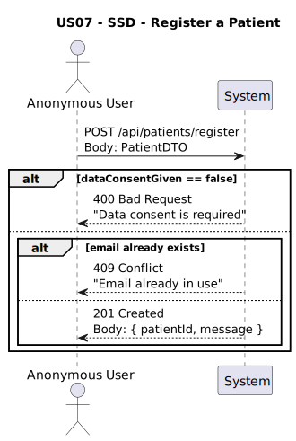
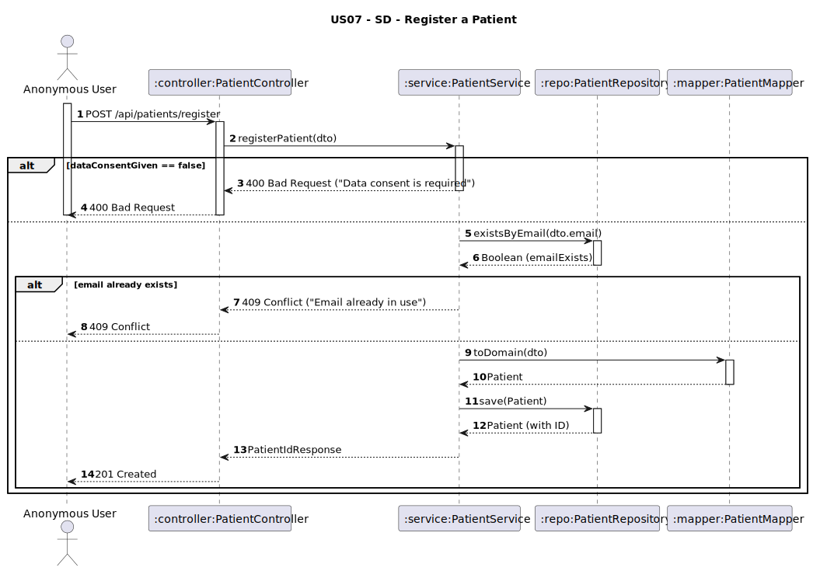

# US07 - Register as a Patient

## 1. Requirements Engineering

### 1.1. User Story Description
As an anonymous user, I want to register as a patient by providing my name, email, password, date of birth, phone number, insurance information, and data consent. A unique patient ID should be assigned automatically.

### 1.2. Customer Specifications and Clarifications
**From the client clarifications:**
> **Q1:** O paciente pode ter mais do que um seguro de saúde?  
> **A1:** ❌ Não. Cada paciente pode ter **apenas um seguro**.

> **Q2:** O paciente pode não ter seguro de saúde?  
> **A2:** ✅ Sim. O seguro é **opcional**.

> **Q3:** O paciente deve fornecer a sua morada no registo?  
> **A3:** ✅ Sim. A morada é **obrigatória**.

### 1.3. Acceptance Criteria
* The system must allow anonymous users to register by providing:
    * Full name
    * Email (must be valid and unique)
    * Password (must meet the following requirements):
      * Minimum 10 characters
      * At least one uppercase letter
      * At least one number
      * At least one special character
    * Phone number
    * Date of birth
    * Address (required)
    * Insurance info (optional)
    * Data consent (must be explicitly accepted)
* A unique `patientId` must be automatically generated.
* Registration must fail if:
    * Required fields (e.g. address, name, dataConsentGiven) are missing
    * Email is not valid or already used
    * Data consent is not given (`false`)
* Analysis and design documentation:
    * Domain model
    * Design justification
    * Sequence diagrams (SSD and SD)
    * Unit test
* OpenAPI specification
* POSTMAN collection with sample request and test
* Proper handling of concurrent access

### 1.4. Found out Dependencies
* D002-01: Requires that email is unique at registration time.
* D002-02: Relies on proper address structure and validation rules defined in `Address`.

### 1.5 Input and Output Data

**Input Data:**
- `fullName: String`
- `email: String`
- `password: String`
- `phoneNumber: String`
- `birthDate: Date`
- `address`:
    - `street: String`
    - `city: String`
    - `postalCode: String`
    - `country: String`
- `insuranceInfo` (optional):
    - `policyNumber: String`
    - `companyName: String`
- `dataConsentGiven: Boolean` (must be `true`)

**Output Data:**
- `patientId: String`
- Confirmation message

### 1.6. System Sequence Diagram (SSD)


### 1.7 Other Relevant Remarks
* This is a **public endpoint**, available without authentication.
* Address is **required** – if not provided, the request must return **400 Bad Request**.
* The `dataConsentGiven` flag is mandatory and must be `true`; otherwise, the system must reject the registration with HTTP 400.
* The system must reject registrations where `dataConsentGiven == false`.
* Email must be valid and **not previously used** by another patient.
* All personal data provided must be persisted securely.

### 1.8 Example Request and Response (JSON)

**Request (POST /api/patients/register):**
```json
{
  "fullName": "Joana Mendes",
  "email": "joana.mendes@gmail.com",
  "password": "JoanaM123##",
  "phoneNumber": "+351934567890",
  "birthDate": "1992-04-25",
  "address": {
    "street": "Rua das Flores, 12",
    "city": "Lisboa",
    "postalCode": "1000-123",
    "country": "Portugal"
  },
  "insuranceInfo": {
    "policyNumber": "POL123456",
    "provider": "HealthCare Plus",
    "coverageType": "Premium"
  },
  "dataConsentGiven": true
}
```
**Response (201 Created):**
```json
{
  "patientId": "PAT01",
  "message": "Patient registered successfully."
}
```

---

## 2. Design - User Story Realization

### 2.1. Rationale

This operation allows an anonymous user to become a registered patient. The system ensures that personal, contact, and legal consent data are collected and validated before the patient is persisted. All validations and entity constructions follow the domain model defined in the system.

The `Patient` entity uses:
- A structured `Address` (required)
- Optional `InsuranceInfo`
- Consent flag (`dataConsentGiven`) which must be true
- Automatically generated `patientId`

This design ensures that data is complete, valid, and compliant with privacy constraints before it is persisted.

### Systematization

Upon receiving the input DTO, the service layer performs the following:
1. Validates required fields (e.g. address, email, name, consent)
2. Verifies that `dataConsentGiven == true`
3. Ensures the `email` is unique in the system
4. Optionally processes `insuranceInfo` if present
5. Generates a unique `patientId`
6. Converts the DTO into a `Patient` domain object
7. Persists the `Patient` entity in the database
8. Returns confirmation and assigned ID to the client

### Design Justification
* Follows SRP: patient data, address, and insurance details are represented via dedicated classes.
* Ensures system extensibility by treating optional components (e.g. insurance) separately.
* Prepares the domain for additional future validations (e.g. health concerns, photo).
* Uses DTO for secure and controlled data flow into the domain model.

## 2.2. Sequence Diagram (SD)

