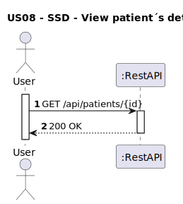
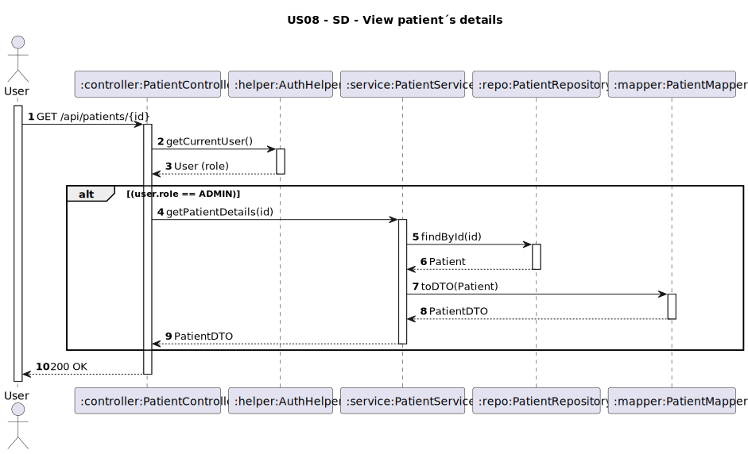

# US08 - View Patient Details

## 1. Requirements Engineering

### 1.1. User Story Description
As an Administrator, I want to view a patient’s details given the patient ID.

### 1.2. Customer Specifications and Clarifications
- No Customer Specifications and Clarifications required.

### 1.3. Acceptance Criteria
* The system must allow an authenticated Administrator to view:
    * Full name
    * Email 
    * Phone number
    * Date of birth
    * Address
    * Insurance info 
    * Data consent 
* Analysis and design documentation:
    * Domain model
    * Design justification
    * Sequence diagrams (SSD and SD)
    * Unit test
* OpenAPI specification
* POSTMAN collection with sample request and test
* Proper handling of concurrent access 

### 1.4. Found out Dependencies
* D008-01: Requires that patients have been registered in the system (US07).

### 1.5 Input and Output Data

**Input Data:**
- `patientId: String` (Path Variable)
- Authenticated user with **ADMIN** role

**Output Data:**
- `fullName: String`
- `email: String`
- `phoneNumber: String`
- `birthDate: Date`
- `dataConsentGiven: Boolean`
- `dataConsentDate: Date`
- `healthConcerns: List<String>`
- `address`:
    - `street: String`
    - `city: String`
    - `postalCode: String`
    - `country: String`
- `insuranceInfo` :
    - `policyNumber: String`
    - `provider: String`
    - `coverageType: String`

  *HTTP Status:*
- `200 OK` – Success

### 1.6. System Sequence Diagram (SSD)


### 1.7 Other Relevant Remarks
* This endpoint is secured and restricted to users with the **ADMIN** role.
* All patient data, including sensitive information, is accessible to administrators.

### 1.8 Example Request and Response (JSON)

**Request (GET http://localhost:8080/api/patients/PAT01):**
**Response (200 OK):**
```json
{
  "patientId": "PAT01",
  "fullName": "Martim Bastos",
  "birthDate": "1990-01-01",
  "phoneNumber": "+351910234567",
  "email": "martimbastos@gmail.com",
  "dataConsentGiven": true,
  "dataConsentDate": "2025-05-17",
  "healthConcerns": [],
  "address": {
    "street": "Rua das Flores 123",
    "city": "Porto",
    "postalCode": "4050-123",
    "country": "Portugal"
  },
  "insuranceInfo": {
    "policyNumber": "POL123456",
    "provider": "HealthCare Plus",
    "coverageType": "Premium"
  }
}
```
---

## 2. Design - User Story Realization

### 2.1. Rationale

This operation allows an Administrator to consult all details of a registered patient. The system enforces role-based access control to ensure that only authorized users can access sensitive patient data.

### Systematization

Upon receiving the request:
1. The system retrieves the authenticated user and validates the **ADMIN** role.
2. Searches for the patient by `patientId`.
3. If the patient exists, maps the entity to a `PatientDTO`.
4. Returns the patient details with **200 OK**.

### Design Justification
* Follows SRP: each layer handles its specific responsibility (authentication, business logic, data mapping).
* Ensures privacy and security by restricting access through role validation.
* Uses DTO to control exposed data and decouple domain entities from API responses.
* Prepared for scalability in case of future role definitions or data access policies.

## 2.2. Sequence Diagram (SD)

