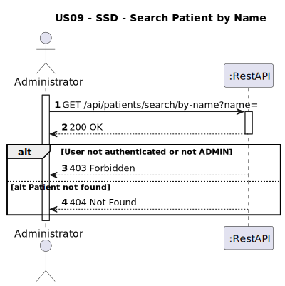
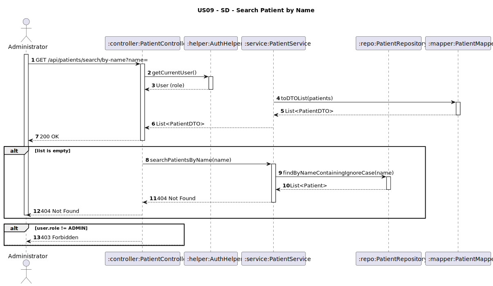

# US09 - Search Patient 

## 1. Requirements Engineering

### 1.1. User Story Description
As an Administrator, I want to search for patients by name.

### 1.2. Customer Specifications and Clarifications
**From the client clarifications:**
> **Question:**  
> O administrador deve procurar pelo nome completo?
>
> **Answer:**  
> Pode pesquisar por qualquer parte do nome
>
> **Question:**  
> No caso de existir algum paciente com o nome pesquisado, o que é que deve ser mostrado ao administrador? Devem ser mostrados todos os dados do paciente? Ou apenas alguns?
>
>
> **Answer:**
> Apenas os dados não médicos

### 1.3. Acceptance Criteria
* The system must return full patient details for authenticated **Administrators**:
    * fullName, birthDate, email, phoneNumber, healthConcerns, dataConsentGiven, dataConsentDate.
* If the patient name does not exist, return **404 Not Found**.
* If the user is not an Administrator, return **403 Forbidden**.
* Analysis and design documentation:
    * Domain model
    * Design justification
    * Sequence diagrams (SSD and SD)
    * Unit test
* OpenAPI specification
* POSTMAN collection with sample request and test
* Proper handling of concurrent access (not applicable - read-only operation)

### 1.4. Found out Dependencies
* D009-01: Requires that patients are previously registered in the system (US07).

### 1.5 Input and Output Data
**Input Data:**
* `name: String (required, via path variable) — full or partial name of the patient`
* `User role (Administrator)`

**Output Data:**
* Typed Data:
    * For ADMIN:
        * fullName : String
        * birthDate : Date
        * email : String
        * phoneNumber : String
        * healthConcerns : String
        * dataConsentGiven : Boolean
        * dataConsentDate : Date
* HTTP Status:
    * 200 OK – Success
    * 404 Not Found – If patient does not exist
    * 403 Forbidden – If user lacks permissions

### 1.6. System Sequence Diagram (SSD)


### 1.7 Other Relevant Remarks
* This endpoint is secured and requires authentication.
* Only users with the **ADMIN** role can access full patient details.

### 1.8 Example Request and Response (JSON)

**GET /api/patients/search/by-name?name=joao**
  **Response (200 OK):**
```json  
 [
      {
        "patientId": "PAT01",
        "fullName": "Martim Bastos",
        "birthDate": "1990-01-01",
        "phoneNumber": "+351910234567",
        "email": "martimbastos@gmail.com",
        "dataConsentGiven": true,
        "dataConsentDate": "2025-05-18",
        "healthConcerns": [],
        "address": {
            "street": "Rua das Flores 123",
            "city": "Porto",
            "postalCode": "4050-123",
            "country": "Portugal"
        },
        "insuranceInfo": {
            "policyNumber": "POL123456",
            "provider": "HealthCare Plus",
            "coverageType": "Premium"
        }
    }
]
 ```
 **Response (404 Not Found):**
```json
{
    "error": "No patients found with name containing: joao"
}
```
 **Response (403 Forbidden):**
```json
{
   "message": "Access denied!",
    "details": [
        "Access Denied"
    ]
}
```

## 2. Design - User Story Realization

### 2.1. Rationale
Esta funcionalidade visa apoiar o trabalho administrativo da clínica, permitindo que o administrador pesquise pacientes pelo nome (total ou parcial) e visualize todos os dados relevantes do perfil. É uma funcionalidade sensível, e por isso está protegida por autenticação e verificação de permissões.
### Systematization
**Envolvidos:**
* User (Administrator) – requisita a pesquisa.
* PatientController – endpoint REST exposto.
* AuthHelper – valida a role de administrador.
* PatientService – lógica de negócio da pesquisa.
* PatientRepository – executa a query na base de dados.
* PatientMapper – converte entidade para DTO de resposta.

### Design Justification
- AuthHelper garante que apenas utilizadores com papel de administrador possam aceder aos dados sensíveis do paciente.
- PatientMapper oculta campos internos (e.g. patientId, insuranceInfo, photo, address) e prepara os dados no formato esperado pelo cliente.
## 2.2. Sequence Diagram (SD)

