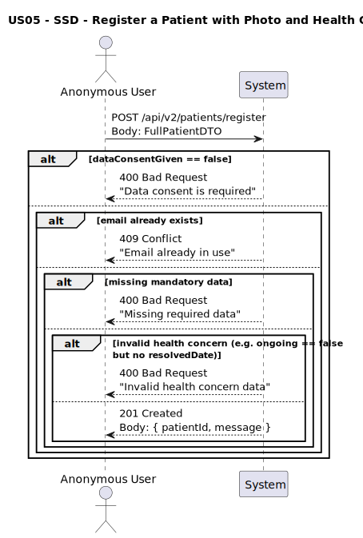
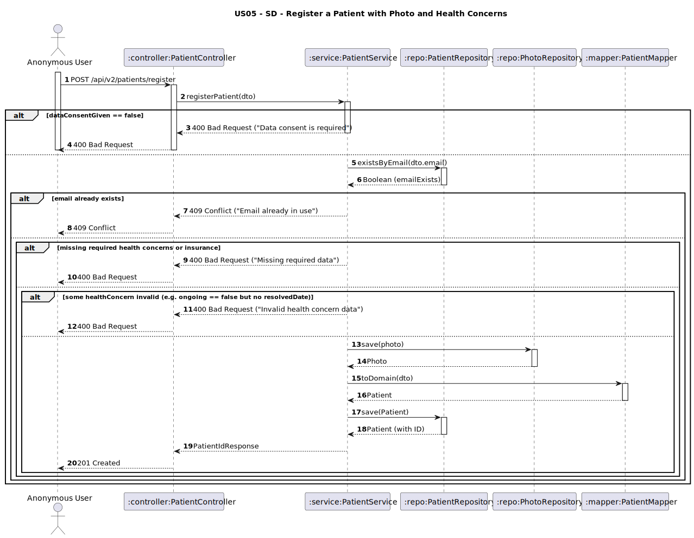

# US05 - Register as a Patient (with photo and health concerns)

## 1. Requirements Engineering

### 1.1. User Story Description
As an anonymous user, I want to register as a patient with a photo and a list of health concerns.

### 1.2. Customer Specifications and Clarifications
**From the client clarifications:**
> **Q1:** Que informação deve ser registada para cada problema de saúde?  
> **A1:** O paciente poderá introduzir:
> - uma **breve descrição**,
> - a **data em que tomou conhecimento da situação**,
> - uma **indicação do tratamento efetuado** (texto livre),
> - e uma **indicação se a situação ainda perdura ou não**.  
    > No caso da situação **já não se verificar**, deve ser indicada a **data na qual ficou resolvida**.

> **Q2:** Os problemas de saúde são obrigatórios no registo?  
> **A2:** ❌ Não. São **opcionais**.

### 1.3. Acceptance Criteria
* The system must allow anonymous users to register by providing:
  * Full name
  * Email (must be valid and unique)
  * Password (must meet the following requirements):
    * Minimum 10 characters
    * At least one uppercase letter
    * At least one number
    * At least one special character
  * Phone number
  * Date of birth
  * Address (**required**)
  * Insurance info (**required**)
  * Data consent (**must be explicitly accepted**)
  * Health concerns (**optional list of structured entries**)
  * Photo (**required** — structured object)

* Each health concern (if any) must contain:
  * `description: String` (brief summary)
  * `diagnosisDate: Date` (when the patient became aware)
  * `treatment: String` (optional notes on treatment)
  * `ongoing: Boolean` (true if still active)
  * `resolvedDate: Date` (optional – only required if ongoing is false)

* A unique `patientId` must be automatically generated.

* Registration must fail if:
  * Required fields (e.g. address, name, dataConsentGiven, insurance, photo) are missing
  * Any health concern is missing mandatory fields or is inconsistent (e.g., `ongoing == false` but no `resolvedDate`)
  * Email is not valid or already used
  * Data consent is not given (`false`)

* Analysis and design documentation:
  * Domain model
  * Design justification
  * Sequence diagrams (SSD and SD)
  * Unit test
* OpenAPI specification
* POSTMAN collection with sample request and test
* Proper handling of concurrent access

### 1.4. Found out Dependencies
* D002-01: Requires that email is unique at registration time.
* D002-02: Relies on proper address structure and validation rules defined in `Address`.
* D002-03: Requires insurance data at registration time.
* D002-04: Requires photo data with structured fields (`url`, `uploadedAt`).

### 1.5 Input and Output Data

**Input Data:**
- `fullName: String`
- `email: String`
- `password: String`
- `phoneNumber: String`
- `birthDate: Date`
- `address`:
  - `street: String`
  - `city: String`
  - `postalCode: String`
  - `country: String`
- `insuranceInfo`:
  - `policyNumber: String`
  - `companyName: String`
- `dataConsentGiven: Boolean` (must be `true`)
- `healthConcerns: List<Object>` (optional; each includes):
  - `description: String`
  - `diagnosisDate: Date`
  - `treatment: String` (optional)
  - `ongoing: Boolean`
  - `resolvedDate: Date` (required if `ongoing == false`)
- `photo`:
  - `url: String`
  - `uploadedAt: DateTime`

**Output Data:**
- `patientId: String`
- Confirmation message

### 1.6. System Sequence Diagram (SSD)

### 1.7 Other Relevant Remarks
* This is a **public endpoint**, available without authentication.
* Address, insurance info, photo and data consent are **required**.
* Health concerns are **optional**, but if provided, must be **validated** for consistency.
* The `dataConsentGiven` flag is mandatory and must be `true`.
* Email must be valid and **not previously used** by another patient.
* All personal data must be persisted securely.
* Photo must be provided and mapped to the `Photo` entity structure (`url`, `uploadedAt`).

### 1.8 Example Request and Response (JSON)

**Request (POST /api/patients/register):**
``json
{
  "fullName": "Pedro Santos",
  "email": "pedro.santos@gmail.com",
  "password": "PedroS@nt0s99",
  "phoneNumber": "+351912345678",
  "birthDate": "1987-06-15",
  "address": {
    "street": "Rua das Amoreiras, 45",
    "city": "Porto",
    "postalCode": "4000-112",
    "country": "Portugal"
  },
  "insuranceInfo": {
    "policyNumber": "POL987654",
    "companyName": "MedCare PT"
  },
  "dataConsentGiven": true,
  "healthConcerns": [
    {
      "description": "Diabetes tipo 2",
      "diagnosisDate": "2010-05-01",
      "treatment": "Metformina 500mg 2x/dia",
      "ongoing": true
    },
    {
      "description": "Asma ligeira",
      "diagnosisDate": "2005-09-10",
      "treatment": "Ventilan em SOS",
      "ongoing": false,
      "resolvedDate": "2020-01-15"
    }
  ],
  "photo": {
    "url": "https://upload.wikimedia.org/wikipedia/commons/d/da/Ange_Postecoglou_%28cropped%29.jpg",
    "uploadedAt": "2025-06-05T10:30:00"
  }
}
``

**Response (201 Created):**
``json
{
  "patientId": "PAT02",
  "message": "Patient registered successfully."
}
``

---

## 2. Design - User Story Realization

### 2.1. Rationale

This operation allows an anonymous user to become a registered patient, while capturing a list of structured health concerns and a required photo. Each health concern includes meaningful medical context to support future features (e.g., clinical decision support, reporting). The system ensures that all mandatory and conditional validations are respected before persisting data.

The `Patient` entity uses:
- A structured `Address` (**required**)
- **Required** `InsuranceInfo`
- **Required** `Photo`
- Optional `HealthConcern` entries (each validated)
- Consent flag (`dataConsentGiven`) which must be true
- Automatically generated `patientId`

### Systematization

Upon receiving the input DTO, the service layer performs the following:
1. Validates required fields (e.g. address, email, name, consent, insurance, photo)
2. Verifies that `dataConsentGiven == true`
3. Ensures the `email` is unique in the system
4. Validates each `HealthConcern` for logical consistency:
  * `resolvedDate` is required if `ongoing == false`
5. Processes and persists the required `photo`
6. Generates a unique `patientId`
7. Converts the DTO into a `Patient` domain object, creating `HealthConcern` sub-objects as needed
8. Persists the `Patient` and related data in the database
9. Returns confirmation and assigned ID to the client

### Design Justification
* Follows SRP: separates concerns into clear subdomains (address, insurance, healthConcern, photo)
* Enforces both field-level and conditional validation logic
* Photo is enforced as mandatory to align with future requirements
* Uses DTO for secure and structured transfer of data between API and domain layers

## 2.2. Sequence Diagram (SD)

