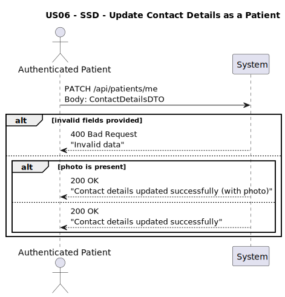

# US06 - Update Contact Details as a Patient

## 1. Requirements Engineering

### 1.1. User Story Description
As a Patient, I want to update my personal contact details (e.g., phone number, address, and photo) so that my information stays current.

### 1.2. Customer Specifications and Clarifications
**From the client clarifications:**
> **Q1:** O paciente pode atualizar qualquer um dos seus dados?  
> **A1:** ❌ Não. Apenas os **dados de contacto** podem ser atualizados

### 1.3. Acceptance Criteria
* The system must allow authenticated patients to update their:
  * `phoneNumber`
  * `address`
  * `photo` 
* The following fields must **not** be updated:
  * `email`
  * `patientId`
  * `dataConsentGiven`
  * `insuranceInfo`
  * `healthConcerns`
* The update must:
  * Persist only the provided fields (partial update)
  * Leave all other data untouched
* The system must return:
  * 200 OK with updated confirmation
  * 400 Bad Request if invalid data is provided
  * 401 Unauthorized if the user is not authenticated
* Analysis and design documentation:
  * Domain model
  * Design justification
  * Sequence diagrams (SSD and SD)
  * Unit test
* OpenAPI specification
* POSTMAN collection with sample request and test
* Proper handling of concurrent access and authentication

### 1.4. Found out Dependencies
* D006-01: Requires JWT-based authentication.
* D006-02: Must resolve the patient identity from the token.
* D006-03: Update must apply only to contact fields.

### 1.5 Input and Output Data

**Input Data:**
- `phoneNumber: String` (optional)
- `address` (optional):
  - `street: String`
  - `city: String`
  - `postalCode: String`
  - `country: String`
- `photo` (optional):
  - `url: String`
  - `uploadedAt: DateTime`

**Output Data:**
- Confirmation message

### 1.6. System Sequence Diagram (SSD)

### 1.7 Other Relevant Remarks
* This endpoint must require JWT authentication.
* Only contact details may be updated; all other fields are ignored.
* The update operation must be **partial** — only provided fields are changed.
* The system must securely replace the photo if a new one is submitted.

### 1.8 Example Request and Response (JSON)

**Request (PATCH /api/patients/me):**
``json
{
  "phoneNumber": "+351910203040",
  "address": {
    "street": "Av. da Liberdade, 100",
    "city": "Lisboa",
    "postalCode": "1250-140",
    "country": "Portugal"
  },
  "photo": {
    "url": "https://upload.wikimedia.org/wikipedia/commons/d/da/Ange_Postecoglou_%28cropped%29.jpg",
    "uploadedAt": "2025-06-05T10:30:00"
  }
}
``

**Response (200 OK):**
``json
{
  "message": "Contact details updated successfully."
}
``

---

## 2. Design - User Story Realization

### 2.1. Rationale

This operation allows patients to maintain up-to-date contact information for communication and system notifications. The change is constrained to basic data and avoids exposure to sensitive or clinical information updates.

The system ensures:
- Updates are limited to contact fields
- All other personal and clinical data remains protected
- Changes are partial and non-destructive

### Systematization

Upon receiving the authenticated request, the system:
1. Authenticates the user via JWT and resolves the patient
2. Validates optional fields:
  * If present: `phoneNumber`, `address`, `photo`
3. Applies updates only to the fields provided
4. Persists the modified `Patient` entity
5. Returns a confirmation message

### Design Justification
* Patients can only update allowed fields.
* Uses partial update (`PATCH`) to support flexibility.
* JWT guarantees secure access to each patient’s own data.
* Keeps full separation from sensitive/clinical data logic.

## 2.2. Sequence Diagram (SD)

