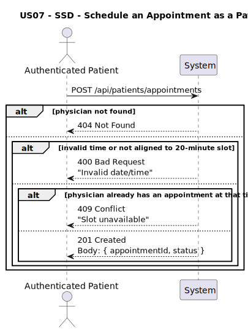
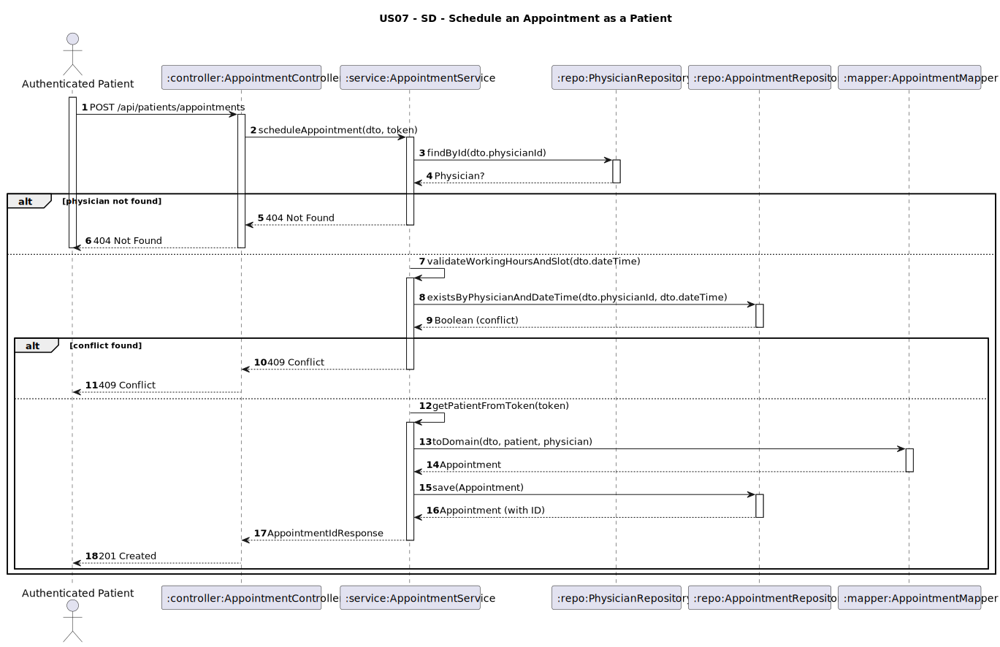

# US07 - Schedule an Appointment as a Patient

## 1. Requirements Engineering

### 1.1. User Story Description
As a Patient, I want to schedule an appointment with a chosen physician by selecting the date, time, and consultation type. The system should verify the physician’s availability.

### 1.2. Customer Specifications and Clarifications
**From the client clarifications:**
> **Q1:** Que tipo de `consultation types` são esperados?  
> **A1:** `"First-time"`, `"Follow-up"` — apenas estes dois tipos.

> **Q2:** Devo impedir marcações duplicadas (mesma data/hora)?  
> **A2:** ✅ Sim. Não pode existir um `Appointment` com o mesmo `physician` e o mesmo `dateTime`.

> **Q3:** Deve existir um campo `status`?  
> **A3:** ✅ Sim. A marcação pode ser cancelada, portanto é necessário um campo `status`. O cliente sugeriu que a nossa análise defina os estados adequados.

> **Q4:** As marcações devem ser organizadas em slots de tempo?  
> **A4:** ✅ Sim. As marcações são organizadas em **slots de 20 minutos**.

> **Q5:** Qual é o horário de funcionamento da clínica?  
> **A5:**
- **Segunda a sexta**: das **9h00 às 13h00** e das **14h00 às 20h00**
- **Sábado**: das **9h00 às 13h00**
- **Domingo**: ❌ Não há marcações.

### 1.3. Acceptance Criteria
* The system must allow an **authenticated patient** to:
  * Select a **registered physician**
  * Choose a valid `dateTime` for the appointment
  * Select one of the predefined `consultationType` values: `"First-time"` or `"Follow-up"`
* The system must:
  * Automatically assign a unique `appointmentId`
  * Check that the selected `physician` is available at the given `dateTime`
  * Reject:
    * Time slots already taken by the physician
    * Appointments outside working hours or that don’t match a valid 20-minute slot
  * Assign default `status = "SCHEDULED"` on creation
* The system must return:
  * `201 Created` with the generated appointmentId and status
  * `400 Bad Request` if validation fails
  * `401 Unauthorized` if the user is not authenticated
  * `409 Conflict` if there is a collision with another appointment

* Analysis and design documentation:
  * Domain model
  * Design justification
  * Sequence diagrams (SSD and SD)
  * Unit test
* OpenAPI specification
* POSTMAN collection with sample request and test
* Proper handling of authentication and concurrent access

### 1.4. Found out Dependencies
* D007-01: Requires that the `Physician` exists in the system.
* D007-02: Requires JWT-based patient authentication.
* D007-03: Requires time slot validation based on clinic schedule.
* D007-04: Requires physician’s appointments to be checked for conflicts.

### 1.5 Input and Output Data

**Input Data:**
- `physicianId: String`
- `dateTime: DateTime` — must:
  * fall within defined working hours,
  * match a 20-minute slot (e.g., `09:00`, `09:20`, `09:40`, …)
- `consultationType: String` (enum: `"First-time"` or `"Follow-up"`)

**Output Data:**
- `appointmentId: String`
- `status: "SCHEDULED"`

### 1.6. System Sequence Diagram (SSD)

### 1.7 Other Relevant Remarks
* This endpoint must require **JWT authentication** with patient role.
* Appointment times must respect the predefined working hours:
  * Monday–Friday: `09:00–13:00`, `14:00–20:00`
  * Saturday: `09:00–13:00`
  * Sunday: ❌ not allowed
* Physician must not already have an appointment at the selected time.
* Consultation type must be valid (`"First-time"` or `"Follow-up"`).
* The system must ensure atomicity to prevent double bookings.

### 1.8 Example Request and Response (JSON)

**Request (POST /api/patients/appointments):**
``json
{
  "physicianId": "phy03",
  "dateTime": "2025-06-10T14:20:00",
  "consultationType": "Follow-up"
}
``

**Response (201 Created):**
``json
{
  "appointmentId": "APT17",
  "status": "SCHEDULED",
  "message": "Appointment successfully scheduled."
}
``

---

## 2. Design - User Story Realization

### 2.1. Rationale

This functionality allows patients to autonomously schedule appointments with available physicians. The system must ensure that business constraints are respected (working hours, availability, valid types), while maintaining system consistency and responsiveness under concurrent usage.

Each `Appointment` must:
- Be tied to the authenticated `Patient`
- Refer to a valid `Physician`
- Include:
  * `dateTime` (aligned to 20-minute slot and clinic hours)
  * `consultationType` (validated)
  * `status = "SCHEDULED"` by default

### Systematization

Once a valid request is received:
1. System authenticates the patient (JWT)
2. Validates the `physicianId` exists
3. Validates `consultationType` is `"First-time"` or `"Follow-up"`
4. Checks that `dateTime`:
  * Falls within working hours
  * Aligns to a valid 20-minute slot
  * Is not already taken by the selected physician
5. Creates an `Appointment` object with:
  * `appointmentId` (generated)
  * status: `"SCHEDULED"`
6. Saves the appointment
7. Returns the result with confirmation

### Design Justification
* Prevents scheduling conflicts via atomic physician availability checks
* Ensures clear and consistent appointment types and time slots
* Authenticated patient context enforces role-level access control
* Aligns with existing domain model and reusable logic from US11

## 2.2. Sequence Diagram (SD)

