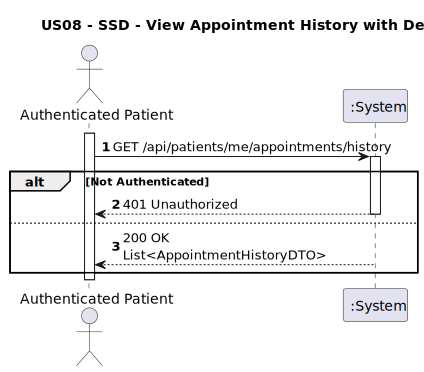
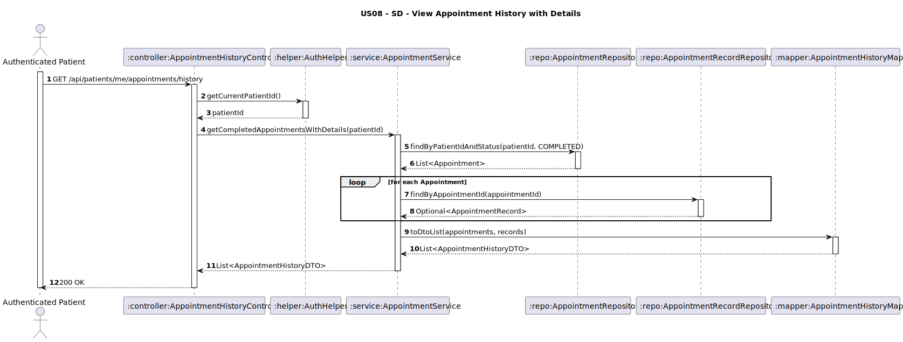

# US08 - View Appointment History with Details

## 1. Requirements Engineering

### 1.1. User Story Description
As a Patient, I want to view my appointment history with details, so that I can review past diagnoses, treatments, and prescriptions provided by my physicians.

### 1.2. Customer Specifications and Clarifications
**From the client clarifications:**
> **Q1:** O que deve ser entendido como “details”?  
> **A1:** O paciente deve poder consultar as **notas do médico**.

### 1.3. Acceptance Criteria
* The system must allow authenticated patients to:
    * Retrieve a list of their past appointments (`Appointment`)
    * View the **diagnosis**, **treatment recommendations**, **prescriptions**, and **duration** of the consultation, if an `AppointmentRecord` exists
* The system must:
    * Validate the patient identity using JWT
    * Only return data for the authenticated patient
    * Exclude future or canceled appointments from the history (only show **completed** ones)
    * Return 200 OK with the list of appointments and respective details
* The system must reject:
    * Unauthorized access (401 Unauthorized)
    * Access to appointments that do not belong to the authenticated patient (403 Forbidden)

* Analysis and design documentation:
    * Domain model
    * Design justification
    * Sequence diagrams (SSD and SD)
    * Unit test
* OpenAPI specification
* POSTMAN collection with sample request and test

### 1.4. Found out Dependencies
* D008-01: Requires the patient to be authenticated via JWT
* D008-02: Requires completed appointments with optional associated `AppointmentRecord`
* D008-03: Requires appointment ownership validation (only return patient's own appointments)

### 1.5 Input and Output Data

**Input:**
- JWT token of the authenticated patient

**Output:**
- List of past `Appointment` entries with optional embedded `AppointmentRecord` data:
    - `appointmentId: String`
    - `dateTime: Date`
    - `consultationType: String`
    - `status: String` (only `COMPLETED`)
    - `record: Object` (optional, if exists)
        - `diagnosis: String`
        - `treatmentRecommendations: String`
        - `prescriptions: String`
        - `duration: Time`

### 1.6. System Sequence Diagram (SSD)



### 1.7 Other Relevant Remarks
* The endpoint must return an **empty list** if the patient has no completed appointments
* Only appointments with status `COMPLETED` should be returned
* For appointments without `AppointmentRecord`, the `record` field should be omitted
* This is a **read-only** operation and does not change system state

### 1.8 Example Request and Response (JSON)

**Request (GET /api/patients/me/appointments/history):**
Authorization: Bearer eyJhbGciOi...


**Response (200 OK):**
```json
[
  {
    "appointmentId": "APT01",
    "dateTime": "2025-05-02T10:20:00",
    "consultationType": "Follow-up",
    "status": "COMPLETED",
    "record": {
      "diagnosis": "Bronquite aguda",
      "treatmentRecommendations": "Repouso e ingestão de líquidos",
      "prescriptions": "Brufen 600mg - 2x/dia por 5 dias",
      "duration": "00:25:00"
    }
  },
  {
    "appointmentId": "APT05",
    "dateTime": "2025-04-10T14:00:00",
    "consultationType": "First-time",
    "status": "COMPLETED",
    "record": null
  }
]
```

**Response (401 Unauthorized):**
```json
{
  "error": "Unauthorized - token is missing or invalid."
}
```

**Response (403 Forbidden):**
```json
{
  "error": "Access denied - patient data does not match token."
}
```

---
## 2. Design - User Story Realization

### 2.1. Rationale
This functionality enables patients to safely review their clinical history without compromising privacy or data ownership. It builds on the domain's relationship between `Appointment` and `AppointmentRecord`, allowing the frontend to show full details where available.

Each appointment in the history must:
- Belong to the authenticated patient
- Be `COMPLETED`
- Optionally include its associated `AppointmentRecord` data

### Systematization

Upon receiving a request:
1. The system authenticates the patient via JWT
2. Retrieves all appointments for the authenticated patient with status `COMPLETED`
3. For each appointment, checks if an `AppointmentRecord` exists
4. Assembles the output DTO list, embedding the record details if available
5. Returns the result with status 200 OK

### Design Justification
* Maintains strict patient privacy by verifying ownership via token
* Returns structured data aligned with existing domain model
* Enables clinical follow-up and transparency for the patient
* Avoids unnecessary data exposure or access to unrelated appointments

## 2.2. Sequence Diagram (SD)

