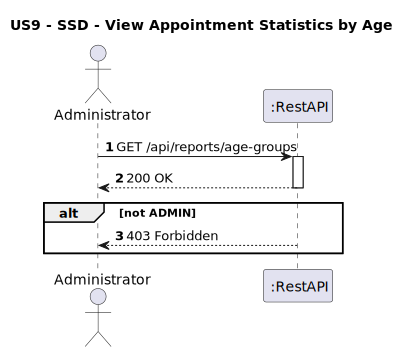
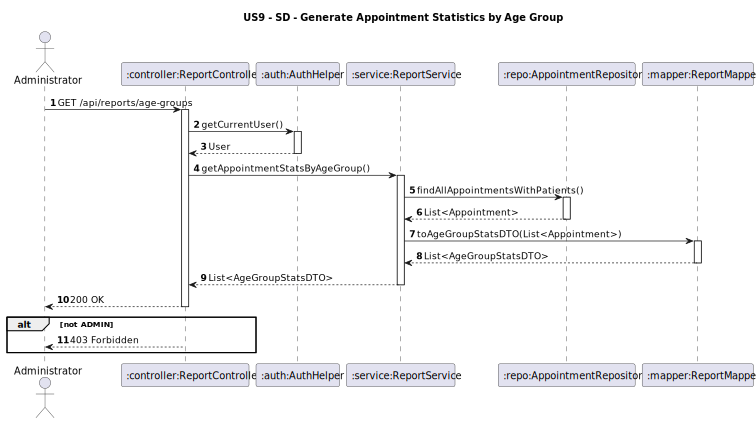

# US09 - Generate Appointment Statistics by Age Group
## 1. Requirements Engineering

### 1.1. User Story Description
As an Administrator, I want to generate statistics on appointments segmented by patient age
groups.
### 1.2. Customer Specifications and Clarifications
**From the client clarifications:**
> **Question:**  

>
> **Answer:**  

### 1.3. Acceptance Criteria
* The system must allow:
    * An Administrator to request appointment statistics grouped by patient age ranges.
* Only users with the role Admin can access this endpoint.
* If the user is not `ADMIN`, return 403 Forbidden.
* Analysis and design documentation:
    * Domain model
    * Design justification
    * Sequence diagrams (SSD and SD)
    * Unit test
* OpenAPI specification
* POSTMAN collection with sample request and test
* Proper handling of concurrent access (not applicable - read-only operation)

### 1.4. Found out Dependencies
* D009-01: Requires that the patients are registered. (US07-A).
### 1.5 Input and Output Data
**Input Data:**
* `User role (Administrator)`
  **Output Data:**
- `ageGroup: String (e.g., "0-17") `
- `appointmentCount: Integer `

* HTTP Status:
    * 200 OK – Success
    * 403 Forbidden – If user lacks permissions

### 1.6. System Sequence Diagram (SSD)


### 1.7 Other Relevant Remarks


### 1.8 Example Request and Response (JSON)

**GET /api/reports/age-groups**

**Response (200 OK):**
```json  

  [

    {
      "ageGroup": "0-17",
      "appointmentCount": 0,
      "averageDuration": 0,
      "averageAppointmentsPerPatient": 0.0
    },
    {
      "ageGroup": "18-35",
      "appointmentCount": 13,
      "averageDuration": 15,
      "averageAppointmentsPerPatient": 13.0
    },
    {
      "ageGroup": "36-59",
      "appointmentCount": 26,
      "averageDuration": 15,
      "averageAppointmentsPerPatient": 13.0
    },
    {
      "ageGroup": "60+",
      "appointmentCount": 0,
      "averageDuration": 0,
      "averageAppointmentsPerPatient": 0.0
    }
  ]


```
**Response (403 Forbidden)**
```json
{
  Only administrators can access this resource
}
```


## 2. Design - User Story Realization

### 2.1. Rationale
This feature gives administrators insight into appointment demand across patient age demographics, supporting data-driven planning and public health strategies.
### Systematization
**Classes involved:**
* ReportController
* ReportService
* AppointmentRepository
* ReportMapper
* AuthHelper

**DTO used:**
* AgeGroupStatsDTO

### Design Justification
* The AuthHelper guarantees that the user is authenticated and authorized.
* The ReportService applies business rules based on user roles.
* The ReportMapper ensures only allowed data is exposed.

## 2.2. Sequence Diagram (SD)


