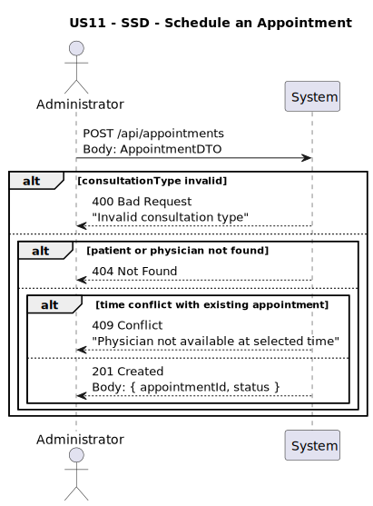
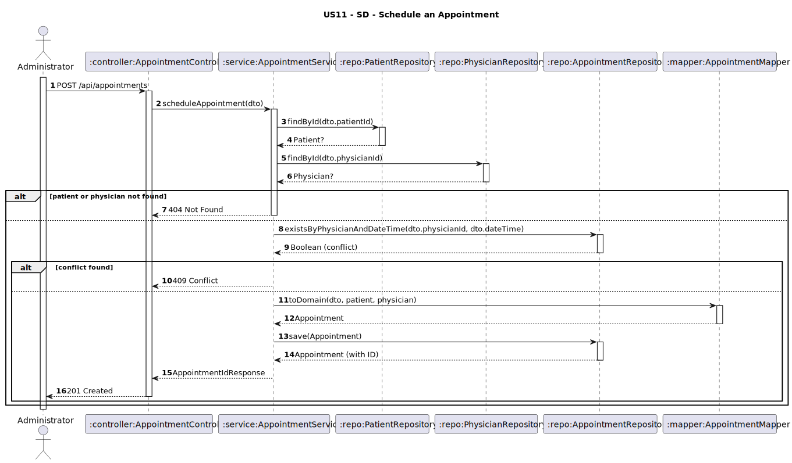

# US11 - Schedule an Appointment

## 1. Requirements Engineering

### 1.1. User Story Description
As an Administrator, I want to schedule an appointment of a patient with a chosen physician by selecting the date, time, and consultation type. Assume the physician is always available.

### 1.2. Customer Specifications and Clarifications
**From the client clarifications:**

> **Q1:** Que tipo de `consultation types` são esperados?  
> **A1:** `"First-time"`, `"Follow-up"` — apenas estes dois tipos.

> **Q2:** Devo impedir marcações duplicadas (mesma data/hora)?  
> **A2:** ✅ Sim. Não pode existir um `Appointment` com o mesmo `physician` e o mesmo `dateTime`.

> **Q3:** Deve existir um campo `status`?  
> **A3:** ✅ Sim. A marcação pode ser cancelada, portanto é necessário um campo `status`. O cliente sugeriu que a nossa análise defina os estados adequados.

> **Q4:** As marcações devem ser organizadas em slots de tempo?  
> **A4:** ✅ Sim. As marcações são organizadas em **slots de 20 minutos**.

> **Q5:** Qual é o horário de funcionamento da clínica?  
> **A5:**
- **Segunda a sexta**: das **9h00 às 13h00** e das **14h00 às 20h00**
- **Sábado**: das **9h00 às 13h00**
- **Domingo**: ❌ Não há marcações.

### 1.3. Acceptance Criteria
* The system must allow an administrator to:
    * Select a registered patient
    * Select a registered physician
    * Choose a valid `dateTime` for the appointment
    * Select one of the predefined consultation types: `"First-time"` or `"Follow-up"`
* The system must:
    * Automatically assign an `appointmentId`
    * Reject requests outside working hours or that don’t match a valid 20-minute slot
    * Assign default `status = "SCHEDULED"` on creation
* Analysis and design documentation:
    * Domain model
    * Design justification
    * Sequence diagrams (SSD and SD)
    * Unit test
* OpenAPI specification
* POSTMAN collection with sample request and test
* Proper handling of concurrent access

### 1.4. Found out Dependencies
* D003-01: Requires that the `Patient` and `Physician` involved in the appointment are already registered.
* D003-02: Requires date and time slot to be aligned with clinic schedule.

### 1.5 Input and Output Data

**Input Data:**
- `patientId: String`
- `physicianId: String`
- `dateTime: DateTime` — must:
  * fall within defined working hours,
  * match a 20-minute slot (e.g., `09:00`, `09:20`, `09:40`, …)
- `consultationType: String` (enum: `"First-time"` or `"Follow-up"`)

**Output Data:**
- `appointmentId: String`
- `status: "SCHEDULED"`

### 1.6. System Sequence Diagram (SSD)


### 1.7 Other Relevant Remarks
* This endpoint is **restricted to ADMIN users**.
* `consultationType` must be one of the two valid options — validation required.
* Appointments must include a `status` field which can later be updated to `"CANCELED"` or `"COMPLETED"` (based on future use cases).
* A validation rule must ensure that the referenced `patientId` and `physicianId` exist.
* The system must reject appointments:
  * outside the defined working schedule,
  * not aligned to 20-minute slots (e.g., `10:17` → ❌ inválido).
  * 
### 1.8 Example Request and Response (JSON)

**Request (POST /api/appointments):**
```json
{
  "patientId": "pat01",
  "physicianId": "phy01",
  "dateTime": "2025-05-02T10:20:00",
  "consultationType": "First-time"
}
```
**Response (201 Created):**
```json
{
  "appointmentId": "APT01",
  "status": "SCHEDULED",
  "message": "Appointment scheduled successfully."
}
```

---

## 2. Design - User Story Realization

### 2.1. Rationale

This operation allows an administrator to create a new appointment between a registered patient and a registered physician. The system enforces validation rules to prevent time conflicts and ensures that only valid consultation types are accepted. Upon successful scheduling, a unique `appointmentId` is generated, and the default status `"SCHEDULED"` is applied.

The design aligns with the domain model, where:
- Each `Appointment` is linked to a `Patient` and a `Physician`
- The `Appointment` contains fields for `dateTime`, `consultationType`, and `status`
- The status may be later updated to `"CANCELED"` or `"COMPLETED"` in future use cases

### Systematization

Upon receiving the input DTO, the service layer:
1. Validates that both `patientId` and `physicianId` exist in the system
2. Verifies that the `consultationType` is either `"First-time"` or `"Follow-up"`
3. Checks if there is an existing appointment with the same `physician` and `dateTime`
4. If conflict is found, the system throws a `409 Conflict`
5. If valid, a new `Appointment` entity is created with status `"SCHEDULED"`
6. The appointment is persisted and the generated `appointmentId` is returned in the response

### Design Justification
* Ensures data consistency by checking for appointment collisions
* Supports extensibility with clearly defined status values and domain rules
* Validation is centralized in the service layer to enforce business constraints

## 2.2. Sequence Diagram (SD)

