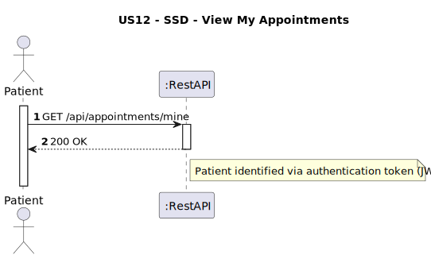
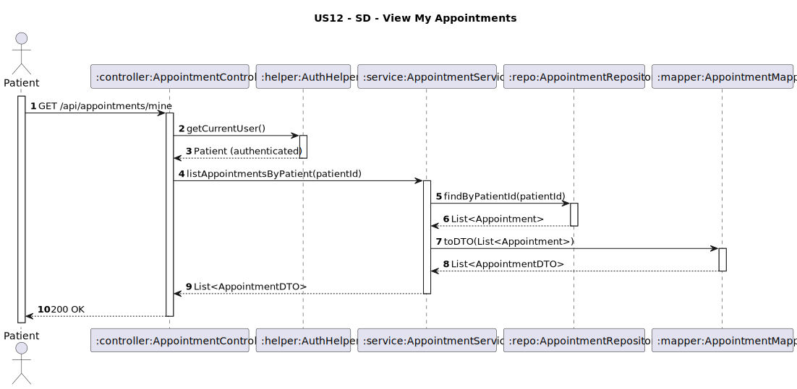

# US12 - View My Appointments

## 1. Requirements Engineering

### 1.1. User Story Description
As a Patient, I want to view my appointments.

### 1.2. Customer Specifications and Clarifications
**From the client clarifications:**
> **Q1:** O paciente pode ver todas as suas consultas, incluindo passadas e futuras?
> **A1:** Sim.

### 1.3. Acceptance Criteria
* The system must allow an authenticated **Patient** to view a list of their appointments.
* Each appointment must display:
    * Date 
    * Time
    * Consultation type
    * Physician name
    * Status (e.g., Scheduled, Completed, Cancelled)
* If the patient has no appointments, return an empty list with **200 OK**.
* Analysis and design documentation:
    * Domain model
    * Design justification
    * Sequence diagrams (SSD and SD)
    * Unit test
* OpenAPI specification
* POSTMAN collection with sample request and test
* Proper handling of concurrent access

### 1.4. Found out Dependencies
* D012-01: Requires that appointments have been previously registered (US11).

### 1.5 Input and Output Data
**Input Data:**
- No parameters (the system identifies the patient via authentication token)

**Output Data:**
- List of `AppointmentDTO`:
    - `date: Date` (format: YYYY-MM-DD)
    - `time: String` (format: HH:mm)
    - `consultationType: String`
    - `physicianName: String`
    - `status: String`
- HTTP Status:
    - `200 OK`

### 1.6. System Sequence Diagram (SSD)



### 1.7 Other Relevant Remarks
* This endpoint is secured and requires **Patient** authentication.
* The system must ensure that only appointments belonging to the authenticated patient are retrieved.
* If there are no appointments, an empty array should be returned.

### 1.8 Example Request and Response (JSON)

**Request (GET http://localhost:8080/api/appointments/mine):**
**Response (200 OK):**
```json
[
  {
    "date": "2025-05-14",
    "time": "10:00:00",
    "consultationType": "FIRST_TIME",
    "physicianName": "Dr. Claudia Santos",
    "status": "SCHEDULED"
  }
]
```
---

## 2. Design - User Story Realization

### 2.1. Rationale

This operation allows a patient to retrieve all their scheduled and past appointments. The system uses the authentication token to identify the patient and ensures that only their own appointments are fetched and displayed.

### Systematization

Upon receiving the request:
1. The controller retrieves the authenticated patient using the **AuthHelper**.
2. The service queries the repository for all appointments linked to the patient.
3. The retrieved entities are converted to DTOs via the **AppointmentMapper**.
4. The system returns the list of appointments with **200 OK**.

### Design Justification
* Follows SRP: authentication, business logic, and data mapping are handled by distinct components.
* Ensures data privacy by restricting access to the patient's own data.
* Uses DTOs to expose only necessary appointment details.
* Prepared for future enhancements, such as filtering by date or status.

## 2.2. Sequence Diagram (SD)


