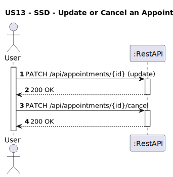
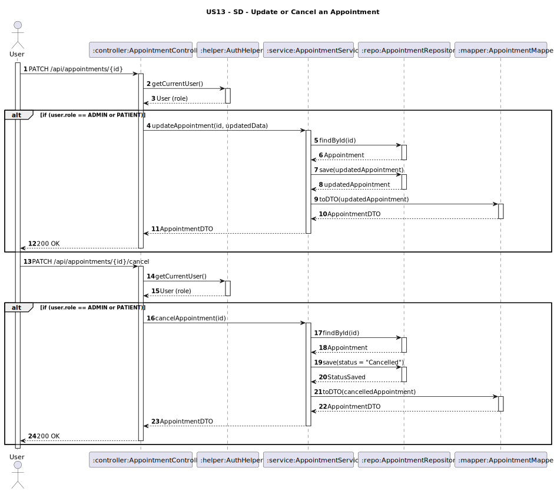

# US13 - Update or Cancel an Appointment

## 1. Requirements Engineering

### 1.1. User Story Description
As a Patient or Administrator, I want to update or cancel an appointment.

### 1.2. Customer Specifications and Clarifications
**From the client clarifications:**
> **Q1:** Um paciente pode atualizar os detalhes da marcação, por exemplo remarcar, ou esta ação está limitada aos administradores?
> **A1:** Pode.

> **Q2:** Quando uma marcação for cancelada, deve ser apagado o registo da mesma, ou deve ficar guardado no sistema como cancelada? 
> **A2:** Deve ser mantido o registo para posterior analise estatistica.

### 1.3. Acceptance Criteria
* The system must allow:
    * **Administrator** or **Patient** to cancel or update appointments.
* When cancelling, the appointment status must be set to `"Cancelled"` without deleting the record.
* Analysis and design documentation:
    * Domain model.
    * Design justification.
    * Sequence diagrams (SSD and SD).
    * Unit test.
* OpenAPI specification.
* POSTMAN collection with sample requests and tests.
* Proper handling of concurrent access.

### 1.4. Found out Dependencies
* D013-01: Requires that appointments exist in the system prior to update or cancel operations.

### 1.5 Input and Output Data

**Input Data:**
- For **Update** (`PATCH http://localhost:8080/api/appointments/APT01`):
    - `date: Date` (optional)
    - `time: String` (optional)
    - `consultationType: String` (optional)
- For **Cancel** (`PATCH http://localhost:8080/api/appointments/APT01/cancel`):
    - No body required.
- Authenticated user (role: ADMIN or PATIENT)

**Output Data (Admin):**

    - `appointmentId: String`
    - `patientId: String`
    - `patientName: String`
    - `physicianId: String`
    - `physicianName: String`
    - `dateTime: DateTime`
    - `consultationType: String`
    - `status: String`

**Output Data (Patient):**

    - `physicianName: String`
    - `dateTime: DateTime`
    - `consultationType: String`
    - `status: String`
- HTTP Status:
    - `200 OK`

### 1.6. System Sequence Diagram (SSD)


### 1.7 Other Relevant Remarks
* Cancelling an appointment updates its status to `"Cancelled"`; the record remains stored.
* The system must validate ownership when a patient requests cancellation.
* Concurrency handling to avoid conflicting updates is required.

### 1.8 Example Request and Response (JSON)

**Request (PATCH http://localhost:8080/api/appointments/APT01):**

**Authorization Token : Admin**
```json
{
  "dateTime": "2025-06-10T11:00:00",
  "consultationType": "FOLLOW_UP"
}
```
**Response (200 OK):**
```json
{
  "appointmentId": "APT01",
  "patientId": "PAT01",
  "patientName": "John Doe",
  "physicianId": "PHY01",
  "physicianName": "Dr. Claudia Santos",
  "dateTime": "2025-06-10T11:00:00",
  "consultationType": "FOLLOW_UP",
  "status": "SCHEDULED"
}
```
---
**Request (PATCH http://localhost:8080/api/appointments/APT01):**

**Authorization Token : Patient**
```json
{
  "dateTime": "2025-06-10T10:00:00",
  "consultationType": "FOLLOW_UP"
}
```
**Response (200 OK):**
```json
{
  "physicianName": "Dr. Claudia Santos",
  "dateTime": "2025-06-10T10:00:00",
  "consultationType": "FOLLOW_UP",
  "status": "SCHEDULED"
}
```
---

**Request (PATCH http://localhost:8080/api/appointments/APT01/cancel):**

**Authorization Token : Admin**
  
**Response (200 OK):**
```json
{
  "appointmentId": "APT01",
  "patientId": "PAT01",
  "patientName": "John Doe",
  "physicianId": "PHY01",
  "physicianName": "Dr. Claudia Santos",
  "dateTime": "2025-06-10T11:00:00",
  "consultationType": "FOLLOW_UP",
  "status": "CANCELED"
}
```
---

**Request (PATCH http://localhost:8080/api/appointments/APT01/cancel):**

**Authorization Token : Patient**

**Response (200 OK):**
```json
{
  "physicianName": "Dr. Claudia Santos",
  "dateTime": "2025-05-14T10:00:00",
  "consultationType": "FIRST_TIME",
  "status": "CANCELED"
}
```
---

## 2. Design - User Story Realization

### 2.1. Rationale

This operation allows administrators and patients to update to cancel them. The system enforces role-based access and ensures that cancellations preserve historical data by updating the appointment status.

### Systematization

Upon receiving the request:
1. The controller retrieves the authenticated user via **AuthHelper**.
2. The service validates permissions based on role and appointment ownership.
3. For **update**:
    - Loads appointment, applies changes, saves, maps to DTO.
4. For **cancel**:
    - Loads appointment, sets status to `"Cancelled"`, saves, maps to DTO.
5. Returns the updated `AppointmentDTO` with **200 OK**.

### Design Justification
* Follows SRP: clear separation between controller, service, repository, and mapper.
* Ensures data integrity by keeping cancelled appointments for audit purposes.
* Uses DTOs to control API exposure.
* Prepared for future extensions (e.g., notification triggers on update/cancel).

## 2.2. Sequence Diagram (SD)

