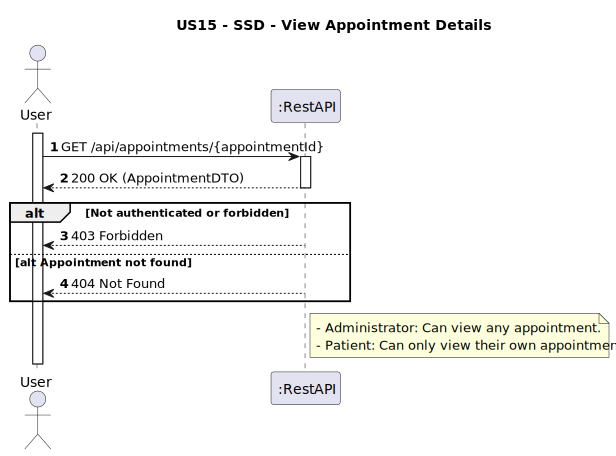
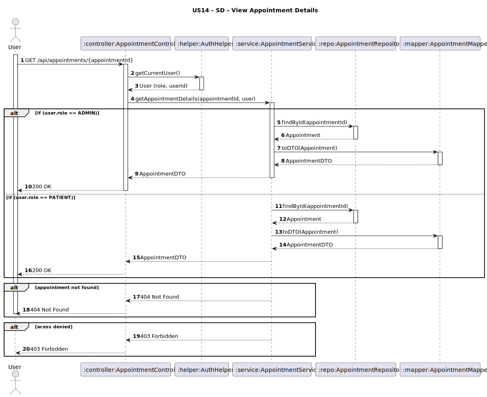

# US14 - View Appointment Details

## 1. Requirements Engineering

### 1.1. User Story Description
As a Patient or Administrator, I want to view the details of an appointment given its appointment number.

### 1.2. Customer Specifications and Clarifications
**From the client clarifications:**
> **Question:**  
> O paciente e o administrador vêem os mesmos detalhes da marcação, ou o paciente tem acesso mais restrito ao nível de detalhes que pode ver?
>
> **Answer:**  
> De momento consultam a mesma informação

### 1.3. Acceptance Criteria
* The system must allow:
    * An Administrator to view any appointment's details.
    * A Patient to view only their own appointments.
* Only users with the role Admin or Patient can access this endpoint.
* If the appointment is not found, return 404 Not Found.
* If a Patient tries to view an appointment that does not belong to them, return 403 Forbidden.
* Analysis and design documentation:
    * Domain model
    * Design justification
    * Sequence diagrams (SSD and SD)
    * Unit test
* OpenAPI specification
* POSTMAN collection with sample request and test
* Proper handling of concurrent access (not applicable - read-only operation)

### 1.4. Found out Dependencies
* D014-01: Requires that the appointment has already been scheduled and the physician must be assigned to the appointment (US11).

### 1.5 Input and Output Data
**Input Data:**
- `appointmentId : String - ID da consulta a ser registada`
 
**Output Data:**
- `appointmentId : String `
- `dateTime: Date `
- `consultationType: String `
- `status: String `
- `physicianName: String `
- `physicianId: String `
- `patientId: String `
- `departmentName: String `
- `specialtyName: String `
- `patientName: String (only visible for Admins) `

### 1.6. System Sequence Diagram (SSD)


### 1.7 Other Relevant Remarks
* The system must guarantee that patients can only access their own data.
* Sensitive information must not be exposed to unauthorized users.

### 1.8 Example Request and Response (JSON)

**GET /api/appointments/APT01**

  **Response (200 OK):**
```json  
{
   "appointmentId": "APT01",
    "patientId": "PAT01",
    "patientName": "Martim Bastos",
    "physicianId": "PHY01",
    "physicianName": "Dr. Claudia Santos",
    "dateTime": "2025-05-15T11:00:00",
    "consultationType": "FOLLOW_UP",
    "status": "SCHEDULED"
}

 ```
 **Response (404 Not Found)**
```json
{
 "message": "Not found",
    "details": [
        "Appointment not found with id: APT03"
    ]
}
```
  **Response (403 Forbidden)**
```json
{
  "message": "Access denied!",
    "details": [
        "Access Denied"
    ]
}
```


## 2. Design - User Story Realization

### 2.1. Rationale
It is critical that only authorized users can view appointment details, ensuring confidentiality of clinical information. Patients may only view their own records, administrators may view all.identiality and integrity.
### Systematization
**Classes involved:**
* AppointmentController
* AppointmentService
* AppointmentRepository
* AppointmentMapper
* AuthHelper

**DTO used:**
* AppointmentDTO

### Design Justification
* The AuthHelper guarantees that the user is authenticated and authorized.
* The AppointmentService applies business rules based on user roles.
* The AppointmentMapper ensures only allowed data is exposed.

## 2.2. Sequence Diagram (SD)

