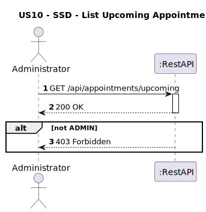
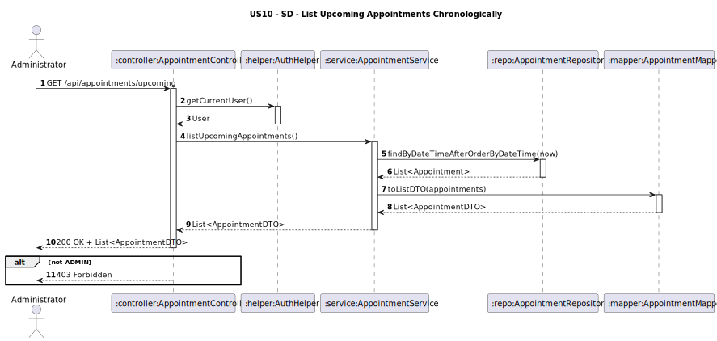

# US10 - List Upcoming Appointments Chronologically
## 1. Requirements Engineering

### 1.1. User Story Description
As an Administrator, I want to list upcoming appointments sorted chronologically.
### 1.2. Customer Specifications and Clarifications
**From the client clarifications:**
> **Question:**  
> Na listagem basta aparecer o ID do appointment ou é necessário aparecer mais algum detalhe?

>
> **Answer:**  
> deve ser indicado o paciente, o médico, a data e hora da consulta

### 1.3. Acceptance Criteria
* The system must allow:
    * An Administrator to view  appointment's sorted ascending by date time.
* Only users with the role Admin can access this endpoint.
* If the user is not `ADMIN`, return 403 Forbidden.
* Analysis and design documentation:
    * Domain model
    * Design justification
    * Sequence diagrams (SSD and SD)
    * Unit test
* OpenAPI specification
* POSTMAN collection with sample request and test
* Proper handling of concurrent access (not applicable - read-only operation)

### 1.4. Found out Dependencies
* D010-01: Requires that the appointment has already been scheduled. (US11).

### 1.5 Input and Output Data
**Input Data:**
* `User role (Administrator)`
**Output Data:**
- `appointmentId : String `
- `dateTime: Date `
- `patientName: String`
- `physicianName: String `
* HTTP Status:
    * 200 OK – Success
    * 403 Forbidden – If user lacks permissions

### 1.6. System Sequence Diagram (SSD)


### 1.7 Other Relevant Remarks


### 1.8 Example Request and Response (JSON)

**GET /api/appointments/upcoming**

**Response (200 OK):**
```json  
{
   "appointmentId": "APT01",
    "patientName": "Martim Bastos",
    "physicianName": "Dr. Claudia Santos",
    "dateTime": "2025-05-15T11:00:00"
}


```
**Response (403 Forbidden)**
```json
{
  "message": "Access denied!",
    "details": [
        "Access Denied"
    ]
}
```


## 2. Design - User Story Realization

### 2.1. Rationale
It is critical that only authorized users can view appointment details, ensuring confidentiality of clinical information. 
### Systematization
**Classes involved:**
* AppointmentController
* AppointmentService
* AppointmentRepository
* AppointmentMapper
* AuthHelper

**DTO used:**
* AppointmentDTO

### Design Justification
* The AuthHelper guarantees that the user is authenticated and authorized.
* The AppointmentService applies business rules based on user roles.
* The AppointmentMapper ensures only allowed data is exposed.

## 2.2. Sequence Diagram (SD)

