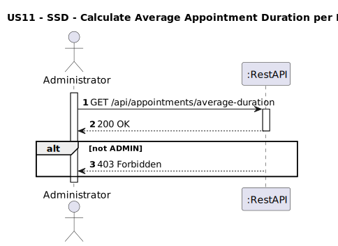
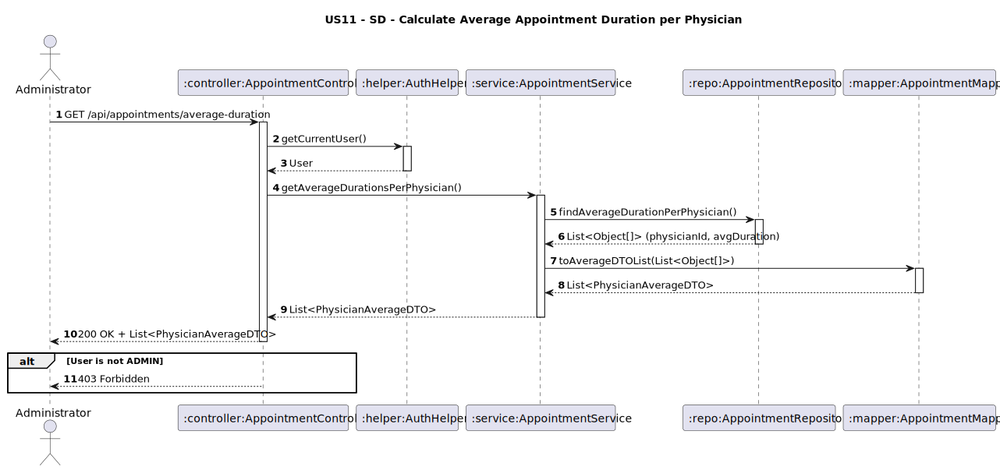

# US11 - Calculate Average Appointment Duration per Physician
## 1. Requirements Engineering

### 1.1. User Story Description
As an Administrator, I want to calculate the average duration of appointments per physician.
### 1.2. Customer Specifications and Clarifications
**From the client clarifications:**
> **Question:**  
> A duração deve aparecer em que formato?

>
> **Answer:**
> minutos


### 1.3. Acceptance Criteria
* The system must allow:
    * An Administrator to view the average duration of appointments per physician.
* Only users with the role Admin can access this endpoint.
* If the user is not `ADMIN`, return 403 Forbidden.
* Analysis and design documentation:
    * Domain model
    * Design justification
    * Sequence diagrams (SSD and SD)
    * Unit test
* OpenAPI specification
* POSTMAN collection with sample request and test
* Proper handling of concurrent access (not applicable - read-only operation)

### 1.4. Found out Dependencies

### 1.5 Input and Output Data
**Input Data:**
* `User role (Administrator)`
  **Output Data:**
- `physicianId: String `
- `averageDuration: Integer `
- `physicianName: String `
* HTTP Status:
    * 200 OK – Success
    * 403 Forbidden – If user lacks permissions

### 1.6. System Sequence Diagram (SSD)


### 1.7 Other Relevant Remarks


### 1.8 Example Request and Response (JSON)

**GET /api/appointments/average-duration-per-physician**

**Response (200 OK):**
```json  
[
  {
    "physicianId": "PHY01",
    "physicianName": "Dr. Ana Costa",
    "averageDuration": 25
  },
  {
    "physicianId": "PHY02",
    "physicianName": "Dr. João Silva",
    "averageDuration": 32
  }
]


```
**Response (403 Forbidden)**
```json
{
  "message": "Access denied!",
    "details": [
        "Access Denied"
    ]
}
```


## 2. Design - User Story Realization

### 2.1. Rationale
This feature helps administrators assess physician efficiency by calculating the average duration of appointments per physician. It supports operational decisions such as resource allocation, performance monitoring, and time management in the clinic.
### Systematization
**Classes involved:**
* AppointmentController
* AppointmentService
* AppointmentRepository
* AppointmentMapper
* AuthHelper

**DTO used:**
* PhysicianAverageDTO

### Design Justification
* The AuthHelper guarantees that the user is authenticated and authorized.
* The AppointmentService applies business rules based on user roles.
* The AppointmentMapper ensures only allowed data is exposed.

## 2.2. Sequence Diagram (SD)

