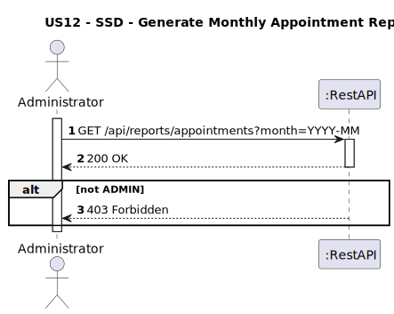
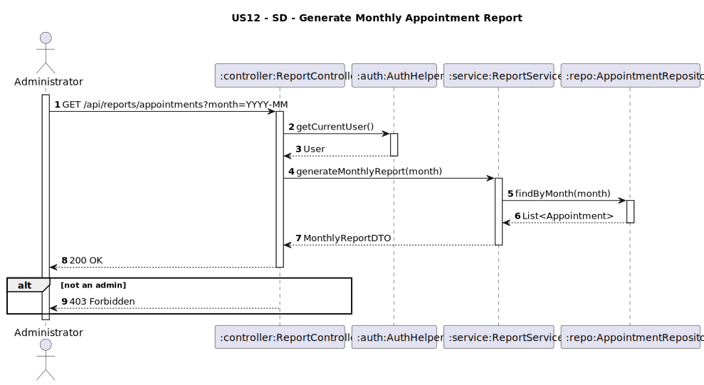

# US12 - Generate monthly reports
## 1. Requirements Engineering

### 1.1. User Story Description
As an Administrator, I want to generate monthly reports showing total appointments,
cancellations, and reschedules
### 1.2. Customer Specifications and Clarifications
**From the client clarifications:**
> **Question:**  

>
> **Answer:**


### 1.3. Acceptance Criteria
* The system must return:
    * Total number of appointments in the given month.
    * Number of cancellations.
    * Number of reschedules.
* Only users with the role Admin can access this endpoint.
* If the user is not `ADMIN`, return 403 Forbidden.
* Analysis and design documentation:
    * Domain model
    * Design justification
    * Sequence diagrams (SSD and SD)
    * Unit test
* OpenAPI specification
* POSTMAN collection with sample request and test
* Proper handling of concurrent access (not applicable - read-only operation)

### 1.4. Found out Dependencies


### 1.5 Input and Output Data
**Input Data:**
* `User role (Administrator)`
* `month parameter in format YYYY-MM`
  **Output Data:**
- `totalAppointments: integer `
- `cancelled: Integer `
- `rescheduled: Integer `
* HTTP Status:
    * 200 OK – Success
    * 403 Forbidden – If user lacks permissions

### 1.6. System Sequence Diagram (SSD)


### 1.7 Other Relevant Remarks


### 1.8 Example Request and Response (JSON)

**GET /api/reports/appointments?month=2025-04**

**Response (200 OK):**
```json  
[
  {
    "totalAppointments": 125,
    "cancelled": 12,
    "rescheduled": 9
  }
]


```
**Response (403 Forbidden)**
```json
{
  "message": "Access denied!",
    "details": [
        "Access Denied"
    ]
}
```


## 2. Design - User Story Realization

### 2.1. Rationale
This report allows administrators to monitor clinic activity trends by month.
It supports operational oversight and decision-making by summarizing appointments, cancellations, and reschedules.
### Systematization
**Classes involved:**
* ReportController
* ReportService
* AppointmentRepository
* AuthHelper

**DTO used:**
* MonthlyReportDTO

### Design Justification
* The AuthHelper guarantees that the user is authenticated and authorized.
* The ReportService applies business rules based on user roles.

## 2.2. Sequence Diagram (SD)

