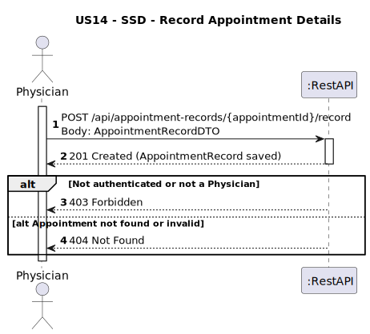

# US14 - Record Appointment Details

## 1. Requirements Engineering

### 1.1. User Story Description
As a Physician, I want to record appointment details (e.g., diagnosis, treatment recommendations, prescriptions) immediately after a consultation.

### 1.2. Customer Specifications and Clarifications
**From the client clarifications:**
> **Question:**  
> 
> **Answer:**  
> 

### 1.3. Acceptance Criteria
* The system must allow a Physician to record the following details for an existing appointment:
    * Diagnosis
    * Treatment recommendations
    * Prescriptions
    * Duration
* Only users with the role PHYSICIAN can access this endpoint.
* If the appointment does not exist, return 404 Not Found.
* If the user is not a physician, return 403 Forbidden.
* Upon success, return 201 Created with confirmation.
* Analysis and design documentation:
    * Domain model
    * Design justification
    * Sequence diagrams (SSD and SD)
    * Unit test
* OpenAPI specification
* POSTMAN collection with sample request and test
* Proper handling of concurrent access (not applicable - read-only operation)

### 1.4. Found out Dependencies
* D014-01: Requires that the appointment has already been scheduled and the physician must be assigned to the appointment (US11).

### 1.5 Input and Output Data
**Input Data:**
- `appointmentId : String - ID da consulta a ser registada`
 
  **Body:**
- `diagnosis: String - diagnóstico realizado`
- `treatmentRecommendations: String -  recomendações de tratamento`
- `prescriptions: String - medicamentos prescritos`
- `duration: Time - duração da consulta`

**Output Data:**
- HTTP 201 Created em caso de sucesso
- HTTP 403 Forbidden se o utilizador não for um médico autenticado
- HTTP 404 Not Found se o appointmentId não existir ou não pertencer ao médico

### 1.6. System Sequence Diagram (SSD)


### 1.7 Other Relevant Remarks
* The controller must verify the user's identity and role.
* The system ensures referential integrity: a record can only be created if the appointment exists.

### 1.8 Example Request and Response (JSON)

** POST /api/appointment-records/APT01/record**
* Host: pcmclinic.example.com
* Body:
{
  "diagnosis": "Bronquite aguda",
  "treatmentRecommendations": "Repouso, líquidos, evitar esforço físico",
  "prescriptions": "Brufen 600mg - 2x/dia por 5 dias",
  "duration": "00:25:00"
}

  **Response (200 OK):**
```json  
{
 "message": "Appointment record created successfully.",
  "appointmentId": "APT01",
  "recordId": "REC01"
}
 ```
 **Response (404 Not Found)**
```json
{
"error": "Appointment not found with id: APT01"
}
```
  **Response (403 Forbidden)**
```json
{
  "message": "Access denied!",
    "details": [
        "Access Denied"
    ]
}
```


## 2. Design - User Story Realization

### 2.1. Rationale
This functionality allows physicians to store critical clinical information immediately after the consultation, ensuring data is fresh and reducing the risk of forgetting relevant details. The restriction to authenticated physicians guarantees confidentiality and integrity.
### Systematization
**Classes involved:**
* AppointmentRecordController
* AppointmentRecordService
* AppointmentRepository
* AppointmentRecordRepository
* AppointmentRecordMapper
* AuthHelper

**DTO used:**
* AppointmentRecordDTO

### Design Justification
* The AuthHelper ensures that only physicians can perform this operation.
* The Mapper layer prevents leaking of internal structures and handles DTO transformation.
* The Service layer validates the appointment and business rules before saving.
* The use of HTTP POST with REST path parameter {appointmentId} follows RESTful principles.

## 2.2. Sequence Diagram (SD)

