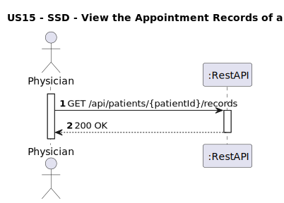
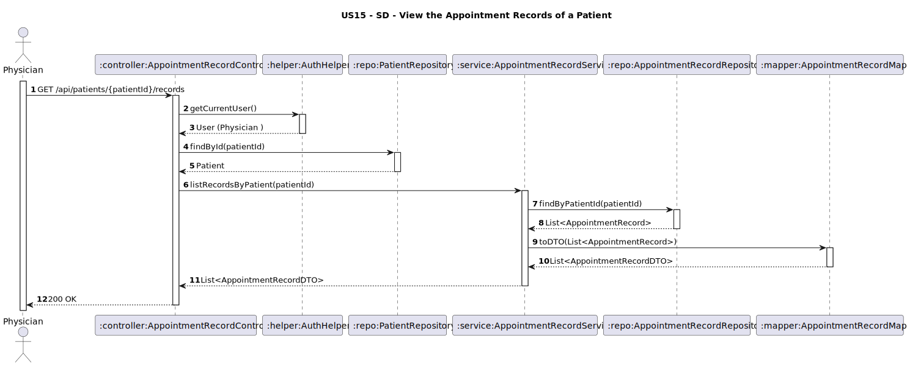

# US15 - View Appointment Records of a Patient

## 1. Requirements Engineering

### 1.1. User Story Description
As a Physician,  I want to view the appointment records of a patient.

### 1.2. Customer Specifications and Clarifications
**From the client clarifications:**
> **Q1:** Na consulta dos registos de um paciente, existe alguma limitação sobre quais médicos podem aceder?
> **A1:** Qq médico pode aceder aos registo de um paciente que esteja a ser acompanhado por si.

### 1.3. Acceptance Criteria
* The system must allow authenticated **Physicians** to:
    * View all appointment records associated with a given `patientId`.
* Return an empty list if the patient has no appointment records.
* Analysis and design documentation:
    * Domain model.
    * Design justification.
    * Sequence diagrams (SSD and SD).
    * Unit test.
* OpenAPI specification.
* POSTMAN collection with sample request and test.
* Proper handling of concurrent access.

### 1.4. Found out Dependencies
* D015-01: Requires that patients and appointment records exist in the system.

### 1.5 Input and Output Data

**Input Data:**
- `patientId: String` (Path Variable)
- Authenticated user (role: PHYSICIAN)

**Output Data:**
- List of `AppointmentRecordDTO`:
    - `diagnosis: String`
    - `treatmentRecommendations: String`
    - `prescriptions: String`
    - `duration: Integer`
    - `appointmentDate: Date`
    - `physicianName: String`
- HTTP Status:
    - `200 OK` – Success

### 1.6. System Sequence Diagram (SSD)


### 1.7 Other Relevant Remarks
* This endpoint is secured and requires **PHYSICIAN** role authentication.
* The system must ensure that only existing patients are queried.
* No sensitive patient data beyond appointment records should be exposed.

### 1.8 Example Request and Response (JSON)

**Request (GET /api/appointment-records/patient/PAT01):**

**Response (200 OK):**
```json
[
{
        "recordId": "REC01",
        "appointmentId": "APT01",
        "physicianName": "Dr. Claudia Santos",
        "diagnosis": "Bronquite aguda",
        "treatmentRecommendations": "Repouso, líquidos, evitar esforço físico",
        "prescriptions": "Brufen 600mg - 2x/dia por 5 dias",
        "duration": "00:25:00"
    }
]

```
 
---

## 2. Design - User Story Realization

### 2.1. Rationale

This operation allows physicians to review the medical history of a patient by listing all recorded appointments. The system ensures that only authenticated physicians can access this data, and validates the existence of the patient before retrieving records.

### Systematization

Upon receiving the request:
1. The controller retrieves the authenticated user via **AuthHelper**.
2. The system checks if the patient exists.
3. If found, fetches all appointment records linked to the patient.
4. Converts the list of entities to DTOs using **AppointmentRecordMapper**.
5. Returns the list with **200 OK**.

### Design Justification
* Follows SRP: clear separation between authentication, data access, and mapping.
* Ensures security by restricting access to physicians.
* Uses DTOs to expose only relevant medical record data.
* Prepared for future enhancements like pagination or filtering.

## 2.2. Sequence Diagram (SD)


