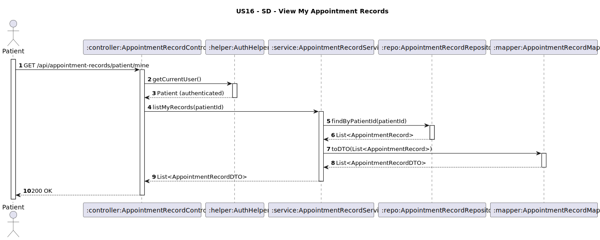

# US16 - View My Appointment Records

## 1. Requirements Engineering

### 1.1. User Story Description
As Patient, I want to view my appointment records.


### 1.2. Customer Specifications and Clarifications
**From the client clarifications:**
> **Q1:** Os registos devem ser devolvidos com alguma ordenação especifica (por ex: data da consulta mais recente primeiro), ou é indiferente?
> **A1:** Ordem cronológica inversa.

### 1.3. Acceptance Criteria
* The system must allow an authenticated **Patient** to:
    * View all their own appointment records.
* If the patient has no records, return an empty list with **200 OK**.
* Analysis and design documentation:
    * Domain model.
    * Design justification.
    * Sequence diagrams (SSD and SD).
    * Unit test.
* OpenAPI specification.
* POSTMAN collection with sample request and test.
* Proper handling of concurrent access.

### 1.4. Found out Dependencies
* D016-01: Requires that appointment records exist for the patient.

### 1.5 Input and Output Data

**Input Data:**
- Authenticated user (role: PATIENT)

**Output Data:**

    - `appointmentId: String`
    - `recordId: String`
    - `physicianName: String`
    - `diagnosis: String`
    - `treatmentRecommendations: String`
    - `prescriptions: String`
    - `duration: Integer`

- HTTP Status:
    - `200 OK` – Success

### 1.6. System Sequence Diagram (SSD)


### 1.7 Other Relevant Remarks
* This endpoint is secured and requires **PATIENT** role authentication.
* The system automatically identifies the patient via the authentication token.
* No data from other patients can ever be exposed.

### 1.8 Example Request and Response (JSON)

**Request (GET /api/records/mine):**

**Response (200 OK):**
```json
[
  {
    "recordId": "REC01",
    "appointmentId": "APT01",
    "physicianName": "Dr. Claudia Santos",
    "diagnosis": "Bronquite aguda",
    "treatmentRecommendations": "Repouso, líquidos, evitar esforço físico",
    "prescriptions": "Brufen 600mg - 2x/dia por 5 dias",
    "duration": "00:25:00"
  }
]
```
---

## 2. Design - User Story Realization

### 2.1. Rationale

This operation allows patients to view their own medical history by listing all appointment records. The system ensures that only the authenticated patient can access their data, maintaining privacy and security.

### Systematization

Upon receiving the request:
1. The controller retrieves the authenticated patient via **AuthHelper**.
2. The service queries the repository for records linked to the patient's ID.
3. The list of entities is converted to DTOs using **AppointmentRecordMapper**.
4. Returns the list with **200 OK**.

### Design Justification
* Ensures strict access control — patients can only view their own data.
* Follows SRP by separating concerns between authentication, business logic, data access, and mapping.
* Uses DTOs to limit exposed data fields.
* Easily extendable for future features like filtering by date.

## 2.2. Sequence Diagram (SD)

