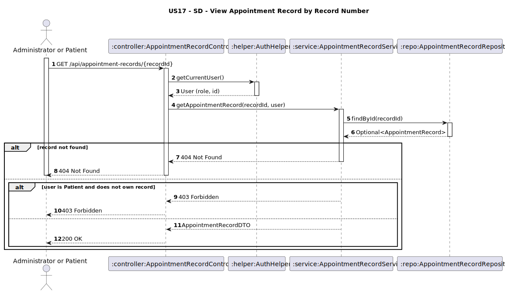

# US17 - View Appointment Record by Record Number

## 1. Requirements Engineering

### 1.1. User Story Description
As an Administrator or Patient, I want to view an appointment record using its record number.

### 1.2. Customer Specifications and Clarifications
**From the client clarifications:**
> **Question:**
>
> **Answer:**

(Não foram necessárias perguntas adicionais. As regras gerais sobre acessos já tinham sido clarificadas: Administrators podem ver qualquer registo, e Patients apenas os seus.)

### 1.3. Acceptance Criteria
* The system must allow:
    * An Administrator to view any AppointmentRecord by providing its `recordId`
    * A Patient to view only AppointmentRecords associated with their own appointments
* Analysis and design documentation:
    * Domain model
    * Design justification
    * Sequence diagrams (SSD and SD)
    * Unit test
* OpenAPI specification
* POSTMAN collection with sample request and test
* Proper handling of concurrent access

### 1.4. Found out Dependencies
* D017-01: Requires that the appointment has been scheduled (US11).
* D017-02: Requires that appointment records have been created (US14).

### 1.5 Input and Output Data

**Input Data:**
- `recordId: String` (identifier of the appointment record to be viewed)

**Output Data:**
- `recordId: String`
- `appointmentId: String`
- `physicianName: String`
- `diagnosis: String`
- `treatmentRecommendations: String`
- `prescriptions: String`
- `duration: Time`

### 1.6. System Sequence Diagram (SSD)

### 1.7 Other Relevant Remarks
* This endpoint is secured and requires authentication.
* Patients can only view their own AppointmentRecords.
* Administrators can view any AppointmentRecord.
* If the record does not exist, the system must return a `404 Not Found`.
* If a patient attempts to access a record not associated with them, the system must return `403 Forbidden`.

### 1.8 Example Request and Response (JSON)

**Request (GET /api/appointment-records/{recordId}):**
```http
GET /api/appointment-records/rec01
Authorization: Bearer <JWT>
Host: pcmclinic.example.com
```

**Response (200 OK):**
```json
{
  "recordId": "REC01",
  "appointmentId": "APT01",
  "physicianName": "Dr. Claudia Santos",
  "diagnosis": "Bronquite aguda",
  "treatmentRecommendations": "Repouso, líquidos, evitar esforço físico",
  "prescriptions": "Brufen 600mg - 2x/dia por 5 dias",
  "duration": "00:25:00"
}
```

**Response (404 Not Found):**
```json
{
  "timestamp": "2025-04-27T10:30:00.000Z",
  "status": 404,
  "error": "Not Found",
  "message": "Appointment record with ID 'REC01' not found",
  "path": "/api/appointment-records/rec01"
}
```

**Response (403 Forbidden) [Patient not authorized]:**
```json
{
  "timestamp": "2025-04-27T10:32:00.000Z",
  "status": 403,
  "error": "Forbidden",
  "message": "Access denied. You are not authorized to view this appointment record.",
  "path": "/api/appointment-records/rec01"
}
```


---
## 2. Design - User Story Realization

### 2.1. Rationale
This operation enables authenticated users to retrieve detailed appointment record information. Strict access control is enforced based on user role to protect patient confidentiality.

- Administrators have full access
- Patients are restricted to their own records

The system uses the `recordId` as the unique key to locate the AppointmentRecord.

### Systematization
**Classes involved:**
* AppointmentRecordController
* AppointmentRecordService
* AppointmentRecordRepository
* AuthHelper

### Design Justification
* The AuthHelper retrieves the current user's identity and role.
* The Service layer validates ownership (for patients) and existence of the record.
* Centralized validation ensures security, following the principle of least privilege.

## 2.2. Sequence Diagram (SD)

